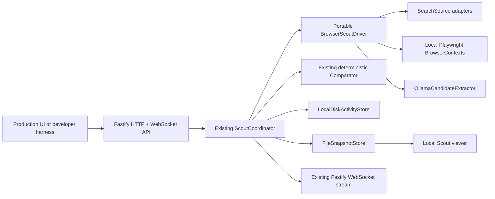

# AWS-Free Happy Scouts Implementation Plan

## Status

**Implemented on 15 August 2026.**

This document records the implemented Scouts discovery, comparison, observability, confirmation, rejection, and Closer-handoff workflow that runs without an AWS account, AgentCore Browser, DynamoDB, S3, or Amazon Bedrock.

The AWS implementation remains available. The fallback must be additive and selected through configuration so the team can use whichever environment is ready first.

## Objective

Provide a command that runs real browser Scouts on a developer laptop:

```bash
pnpm dev:local-agent
```

The resulting system must:

- Launch real Chromium browsing sessions with Playwright.
- Run two complementary Scouts per item.
- Search public web pages and open merchant listings.
- Extract normalized candidates with a locally running model.
- Continue using deterministic comparison arithmetic.
- Stream genuine stages and screenshots to the existing harness/UI.
- Provide an expandable local browser-view link.
- Persist useful Activity state and screenshots across API restarts.
- Support confirmation, rejection, retained alternatives, and item-scoped re-search.
- Produce the existing minimal Closer handoff.
- Require no AWS credentials or Bedrock model ID.
- Preserve all existing browsing and payment safety boundaries.

## Recommended fallback

Use the following stack:

| Concern | AWS implementation | AWS-free implementation |
|---|---|---|
| Browser | AgentCore Browser | Local Playwright Chromium |
| Browser isolation | One AgentCore session per Scout | One isolated Playwright `BrowserContext` per Scout |
| Extraction | Bedrock `Converse` | Ollama structured JSON output |
| Coordinator | Existing `ScoutCoordinator` | Existing `ScoutCoordinator` unchanged |
| Comparison | Existing deterministic Comparator | Existing deterministic Comparator unchanged |
| State | DynamoDB | Atomic local JSON store initially |
| Event replay | DynamoDB events | Local append-only Activity events |
| Screenshots | Encrypted S3 | Gitignored local data directory |
| Event delivery | API Gateway WebSocket | Existing Fastify WebSocket |
| Live browser view | AgentCore Live View | Snapshot-based local viewer plus optional headed Chromium |
| Infrastructure | CDK/AWS | Local Node.js processes |

Playwright can install and launch Chromium locally, navigate pages, and capture screenshots. Ollama supports local chat requests with JSON-schema structured outputs, which can be validated through the existing Zod schemas.

References:

- [Playwright browser installation](https://playwright.dev/docs/browsers)
- [Playwright browser launch and connection](https://playwright.dev/docs/api/class-browsertype)
- [Playwright screenshots](https://playwright.dev/docs/screenshots)
- [Ollama chat API](https://docs.ollama.com/api/chat)
- [Ollama structured outputs](https://docs.ollama.com/capabilities/structured-outputs)
- [Ollama OpenAI compatibility](https://docs.ollama.com/api/openai-compatibility)

## Why this fits the existing architecture

The domain logic is already independent of AWS. `ScoutCoordinator` depends on interfaces in `@happy/runtime`, while AWS behavior lives in `@happy/aws`.

The following functionality can remain unchanged:

- Request and event contracts.
- Scout and item state machines.
- Five-item queue semantics.
- Candidate normalization and deduplication rules.
- Hard eligibility filters.
- All scoring arithmetic and ranking presets.
- Activity-scoped event sequencing.
- Confirmation and Closer handoff.
- Retained alternatives and item-scoped re-search.
- Public URL restrictions and untrusted-content framing.

The work primarily consists of adding local implementations behind ports and making the API select a dependency profile from configuration.

## Target architecture



## Runtime profiles

Introduce three explicit profiles:

| `SCOUT_MODE` | Purpose | Browser | Extraction | Persistence |
|---|---|---|---|---|
| `mock` | Fast deterministic development and CI | Synthetic | Fixture candidates | Memory |
| `local` | Real no-AWS demo | Local Playwright | Ollama | Local disk |
| `aws` | AWS-native deployment | AgentCore Browser | Bedrock | DynamoDB/S3 |

`pnpm dev` should remain the safe mock default. New commands make real-agent intent explicit:

```bash
pnpm dev:mock
pnpm dev:local-agent
pnpm smoke:local-browser
```

The AWS application remains separate until the production HTTP control plane is completed.

## Planned code changes

### 1. Add portable browser and extraction ports

Update `packages/runtime/src/ports.ts` with interfaces that separate browser execution from model extraction.

Proposed shapes:

```ts
export type BrowserSessionHandle = {
  id: string;
  page: BrowserPage;
};

export interface BrowserSessionProvider {
  start(input: {
    activityId: string;
    itemId: string;
    scoutId: string;
    locale: string;
  }): Promise<BrowserSessionHandle>;
  stop(session: BrowserSessionHandle): Promise<void>;
}

export interface CandidateExtractor {
  extract(input: {
    activityId: string;
    item: ItemSearchRequest;
    scout: ScoutRecord;
    canonicalUrl: string;
    untrustedPageText: string;
  }): Promise<Candidate>;
}

export interface SearchSource {
  discover(input: {
    item: ItemSearchRequest;
    strategy: ScoutStrategy;
    attempt: number;
    page: BrowserPage;
  }): Promise<string[]>;
}
```

`BrowserPage` should be a narrow project-owned interface rather than exposing the entire Playwright API to domain code. It needs only navigation, link extraction, readable text, current URL, and screenshot operations.

### 2. Extract a portable real-browser Scout driver

Create a reusable `BrowserScoutDriver` that coordinates:

1. Start a browser session.
2. Emit `discovering`.
3. Ask the selected `SearchSource` for listing URLs.
4. Apply `assertSafePublicUrl` to every navigation target.
5. Open one candidate at a time.
6. Capture a throttled screenshot.
7. Emit `analyzing`.
8. Frame webpage text as untrusted data.
9. Ask `CandidateExtractor` for structured evidence.
10. Validate through `CandidateSchema`.
11. Emit `gathering` and persist the candidate.
12. Repeat until the target is met.
13. Stop the browser session in `finally`.

The driver should live outside `@happy/core` because it performs I/O. A suitable location is `packages/runtime/src/browser-scout.ts` if it depends only on project-owned ports, or `packages/browser/src` if the implementation requires Playwright types.

Refactor `BedrockBrowserScoutDriver` to use the same extraction contract where practical. This prevents the local and AWS paths from drifting into different Scout behaviors.

### 3. Add `packages/local`

Create a new workspace package:

```text
packages/local/
├── src/
│   ├── index.ts
│   ├── local-playwright.ts
│   ├── ollama-extractor.ts
│   ├── local-disk-store.ts
│   ├── file-snapshot-store.ts
│   ├── local-live-view.ts
│   └── cleanup.ts
├── package.json
└── tsconfig.json
```

The package may import Playwright and local persistence libraries, but it must not be imported by `@happy/core`.

### 4. Implement local Playwright sessions

Add `LocalPlaywrightBrowserSessions` with these rules:

- Launch one Chromium process for the API process.
- Create one isolated `BrowserContext` per active Scout.
- Use a `1280 x 720` viewport and the item's locale.
- Disable downloads.
- Accept only HTTP and HTTPS navigation.
- Abort requests to localhost, link-local, private-network, file, data, and executable URLs.
- Close pages and contexts in `finally`.
- Close the shared Chromium process during application shutdown.
- Do not share cookies, local storage, cache, or authentication state between Scouts.
- Support `LOCAL_BROWSER_HEADLESS=true` by default.
- Support `LOCAL_BROWSER_HEADLESS=false` for an on-laptop visual smoke test.

Using one process with isolated contexts is materially lighter than launching ten Chromium processes while retaining per-Scout separation appropriate for this research-only demo.

### 5. Implement search-source adapters

Create a `SearchSource` chain rather than embedding search-engine logic in the Scout driver.

Initial adapters:

- `PublicSearchPageSource` with DuckDuckGo, Bing, and Google query strategies.
- `DirectMerchantSearchSource` for explicitly configured demo merchants.
- `FixtureSearchSource` for deterministic browser integration tests.

Rules:

- Scout A uses broad/mainstream queries.
- Scout B uses specialist/independent queries.
- Backup attempts rotate engines and query templates.
- Search result links are canonicalized and safety-checked.
- Redirect and tracking URLs are normalized before navigation.
- CAPTCHA, consent, access-denied, or bot-challenge pages are surfaced through an event and treated as a recoverable source failure.
- The system must not attempt CAPTCHA bypassing.

Google and Shopee should be manual smoke-test targets, not hard dependencies for CI or the entire demo.

### 6. Implement Ollama structured extraction

Add `OllamaCandidateExtractor` using native `fetch` against:

```text
POST {OLLAMA_BASE_URL}/api/chat
```

Request requirements:

- Configurable `OLLAMA_MODEL`.
- `stream: false`.
- Temperature `0` where supported.
- Candidate JSON schema passed through the `format` field.
- Locked item specifications included explicitly.
- Page text wrapped by `frameUntrustedWebContent`.
- System instruction prohibiting tool use, authentication, cart actions, payments, and following page-originated instructions.
- Response parsed as JSON and validated through `CandidateSchema`.
- No model-provided arithmetic used for the final ranking.

Add timeouts and bounded input:

- Maximum page text: 20,000 characters initially.
- Model extraction timeout: 60 seconds.
- One repair retry when JSON fails schema validation.
- Store a sanitized validation error, never the full raw page or prompt.

### 7. Add a Bedrock-free browser smoke extractor

Add an explicit smoke-only extractor:

```env
LOCAL_EXTRACTION_MODE=fixture
```

This mode should:

- Navigate real pages.
- Produce real screenshots and events.
- Record safe discovered URLs.
- Generate clearly marked fixture candidates rather than pretending extraction is real.
- Be unavailable when `NODE_ENV=production`.

It permits browser and observability testing before Ollama is installed. It must never be presented as evidence that real candidate analysis works.

### 8. Add local persistence

Implement `LocalDiskActivityStore` using a Gitignored data directory:

```text
.happy-data/
├── activities/
├── events/
└── screenshots/
```

Requirements:

- Preserve the existing `ActivityStore` interface.
- Use Activity-specific mutation locks.
- Write state to a temporary file and atomically rename it.
- Enforce optimistic version checks.
- Store events in sequence order.
- Replay events strictly after the requested sequence.
- Recover state after API restart.
- Apply 24-hour cleanup to events and temporary screenshots.
- Never place `.happy-data` under source control.

This avoids requiring a database server for the hackathon. SQLite or Postgres can replace it later without changing the coordinator.

### 9. Add filesystem screenshots

Implement `FileSnapshotStore`:

- Write images under `.happy-data/screenshots/{activityId}/{itemId}/{scoutId}/`.
- Retain only the latest few frames per Scout.
- Generate opaque snapshot identifiers rather than exposing arbitrary paths.
- Serve images through the existing snapshot endpoint.
- Preserve the one-frame-per-second coordinator cap.
- Run cleanup at startup and periodically.
- Treat write failures as non-fatal observability failures.

### 10. Add a local browser-view link

Implement `LocalLiveViewProvider` that returns a normal application URL:

```text
http://localhost:3001/v1/scouts/{scoutId}/live
```

The route should render a minimal viewer containing:

- Scout and item identity.
- Current stage and stage detail.
- Latest screenshot refreshed through Activity events.
- Current sanitized hostname.
- Listings gathered.
- A clear label that this is a screenshot stream, not remote browser control.

The harness should make each Scout tile expandable and request the provider URL only when expanded.

For direct developer observation, `LOCAL_BROWSER_HEADLESS=false` opens the real Chromium window on the host machine. This is useful for the Google-to-Shopee smoke test but should not be required for the production UI.

### 11. Add configuration-based dependency wiring

Refactor `apps/api/src/app.ts` so dependency creation is not permanently hardcoded to mock mode.

Proposed files:

```text
apps/api/src/dependencies.ts
apps/api/src/profiles/mock.ts
apps/api/src/profiles/local.ts
```

Startup logic:

```ts
switch (process.env.SCOUT_MODE) {
  case "mock":
    return createMockDependencies();
  case "local":
    return createLocalAgentDependencies();
  default:
    throw new Error("Unsupported SCOUT_MODE");
}
```

Do not silently fall back from `local` to mock if Playwright or Ollama is unavailable. Startup must fail with an actionable error so a demo is never mistaken for real browsing.

### 12. Update the harness

The developer harness should remain minimal, but add:

- Visible runtime badge: `MOCK`, `LOCAL REAL BROWSER`, or `AWS`.
- Visible extraction badge: `FIXTURE`, `OLLAMA`, or `BEDROCK`.
- Expand button on each Scout tile.
- Local live-view page or modal.
- Current hostname and action detail.
- Low-coverage warning.
- Browser/source failure message without exposing raw logs.
- Confirmation and rejection controls for end-to-end manual testing.
- Clear warning when fixture extraction is active.

The teammate-owned production UI can consume the same events and URLs later.

## Configuration changes

Update the existing `.env.example`; do not add other committed `.env` files.

Proposed variables:

```env
SCOUT_MODE=mock

# Local real-browser profile
LOCAL_BROWSER_HEADLESS=true
LOCAL_EXTRACTION_MODE=ollama
LOCAL_DATA_DIR=.happy-data
MAX_CONCURRENT_ITEMS=2

# Local model
OLLAMA_BASE_URL=http://127.0.0.1:11434
OLLAMA_MODEL=replace-with-installed-local-model

# Local browser viewer
PUBLIC_API_URL=http://localhost:3001
```

Rules:

- `MAX_CONCURRENT_ITEMS` defaults to `2` in local mode, resulting in four simultaneous Scouts.
- It may be raised to `5` on sufficiently capable hardware.
- It must never exceed `5`.
- `.happy-data/` must be added to `.gitignore`.
- No Ollama model name should be assumed to exist; startup checks the configured model.

## Package and script changes

Update the root scripts:

```json
{
  "dev": "existing safe mock command",
  "dev:mock": "explicit mock command",
  "dev:local-agent": "run API/harness with SCOUT_MODE=local",
  "browser:install": "install Playwright Chromium",
  "smoke:local-browser": "run Google-to-Shopee browser smoke flow"
}
```

Environment setting should be cross-platform. Use a small TypeScript launcher or `cross-env` rather than shell-specific variable syntax.

The browser installation command should use the Playwright version pinned by the workspace lockfile.

## Google-to-Shopee smoke flow

Add a manual smoke command that does not require AWS or Bedrock:

```bash
pnpm smoke:local-browser
```

Expected behavior:

1. Start Chromium.
2. Create one isolated Scout context.
3. Print the local viewer URL.
4. Navigate to `https://www.google.com/`.
5. Search for a configurable product with a Shopee-oriented query.
6. Display screenshots and current stage in the viewer.
7. Open a safe `shopee.sg` result when available.
8. If search results cannot be parsed, navigate directly to a configured Shopee search URL.
9. Detect and report consent, CAPTCHA, access-denied, or bot-challenge pages.
10. Keep the session open for a configurable inspection period.
11. Close the context and Chromium cleanly.

Success for this smoke test means the browser navigation and observability pipeline worked. It does not mean candidate extraction, authenticity assessment, or merchant reliability has passed.

## Delivery sequence

### Phase 1 — preserve behavior while adding seams

1. Add `CandidateExtractor`, `BrowserSessionProvider`, and `SearchSource` ports.
2. Extract reusable browser-Scout orchestration.
3. Adapt the existing AWS driver without changing externally visible behavior.
4. Extend unit tests around the new ports.

Exit criterion: `pnpm validate` passes and the existing mock behavior is unchanged.

### Phase 2 — real local browser and viewer

1. Create `@happy/local`.
2. Implement local Playwright contexts.
3. Implement fixture extraction mode.
4. Implement filesystem screenshots.
5. Add local live-view page.
6. Add `smoke:local-browser`.

Exit criterion: Google-to-Shopee navigation can be watched without AWS or Bedrock.

### Phase 3 — local model extraction

1. Implement Ollama extractor.
2. Pass a JSON schema and validate with Zod.
3. Add repair retry and sanitized failure handling.
4. Run one real item with two Scouts.
5. Confirm at least three pooled candidates where the selected sources permit it.

Exit criterion: one real item reaches `awaiting_confirmation` using local Playwright and Ollama.

### Phase 4 — persistent complete fallback

1. Implement local disk Activity and event storage.
2. Add restart/replay tests.
3. Add cleanup tasks.
4. Add confirmation and rejection controls to the harness.
5. Validate Closer handoff after API restart.

Exit criterion: the complete workflow survives a controlled API restart and produces the same Closer contract.

### Phase 5 — demo hardening

1. Test two or three demo merchants.
2. Tune query strategies and per-merchant extraction evidence.
3. Measure memory with four and ten active Scouts.
4. Select a safe default concurrency.
5. Document known blocked merchants and challenge behavior.
6. Record a deterministic fallback demo request.

Exit criterion: the team can run the demo from a clean machine using documented commands.

### Optional Phase 6 — Browserbase provider

Only implement this if the team has a Browserbase account and prefers hosted browser sessions.

Add:

- `BrowserbaseBrowserSessionProvider`.
- Temporary Live View URLs.
- Browserbase environment placeholders in `.env.example`.
- Provider contract tests with mocked API responses.

Do not make Browserbase mandatory for local mode.

## Test plan

### Unit tests

- Local dependency profile validates required configuration.
- Browser contexts are isolated per Scout.
- Every navigation passes through the public URL guard.
- Candidate extraction input is framed as untrusted data.
- Ollama JSON is validated by `CandidateSchema`.
- Malformed model output receives at most one repair attempt.
- Model timeouts become Scout recovery events.
- Filesystem paths cannot escape `LOCAL_DATA_DIR`.
- Activity versions reject stale writes.
- Event sequences remain contiguous after restart.
- Snapshot failure remains non-fatal.
- Cleanup removes only expired local artifacts.

### Integration tests

- Portable browser driver with fake browser and extractor ports.
- Local disk store restart and event replay.
- Fastify API in `mock` and `local fixture` profiles.
- Two Scouts share and deduplicate a candidate pool.
- One Scout failure produces a low-coverage result when allowed.
- Pause, resume, cancel, rejection, and item-only restart.
- Viewer receives the latest snapshot without polling per event.

### Manual tests

- Headed Chromium navigation to Google and Shopee.
- One item using local Playwright and Ollama.
- Six items showing twelve Scouts, configured local concurrency, and queued overflow.
- API restart followed by correct event replay.
- Selection confirmation and exact Closer handoff.
- CAPTCHA/access-denied page is visible and not bypassed.

### Security tests

- Page prompt injection cannot alter Scout goals.
- Local/private/file/data/executable URLs are blocked.
- Browser downloads are disabled.
- No authentication, cart, checkout, or payment action exists.
- Local files cannot be read through page navigation.
- Screenshot and model logs do not contain prompts, environment variables, or credentials.
- Secret scan includes all new config and fixtures.

## Acceptance criteria

The fallback is complete when all of the following are true:

- A clean machine can run the documented setup without AWS credentials.
- `BEDROCK_MODEL_ID` and `AGENTCORE_BROWSER_ID` are unnecessary in local mode.
- `pnpm dev:local-agent` starts the API and harness.
- Two real Playwright Scouts run per item.
- Scout A and Scout B use visibly different search strategies.
- The UI shows genuine stage movement and current screenshots.
- A local viewer link opens for an active Scout.
- Real webpage text is converted to Zod-validated candidate data by Ollama.
- Comparison remains deterministic and model-independent.
- Local mode respects a configurable maximum no greater than ten Scouts.
- Useful Activity state and events survive API restart.
- Rejection restarts only the affected item after retained alternatives are exhausted.
- Confirmed selections produce the existing Closer handoff.
- Google/Shopee challenges are surfaced without bypass attempts.
- `pnpm validate`, `pnpm secrets:check`, and `git diff --check` pass.
- Mock and AWS code paths remain available.

## Hackathon cut line

If time is limited, prioritize in this order.

### Must have

- Local Playwright browser contexts.
- Ollama extraction validated with Zod.
- Existing in-memory coordinator state.
- Existing WebSocket events and screenshot tiles.
- Configurable local concurrency.
- One real item with two Scouts and deterministic comparison.
- Confirmation and Closer handoff.

### Strongly recommended

- Local browser-view page.
- File screenshot storage.
- Google-to-Shopee smoke command.
- Retained-alternative rejection test.

### Can wait

- Restart-persistent Activity storage.
- Browserbase provider.
- Ten simultaneous local Scouts.
- Interactive remote control of the browser.
- Multi-host production deployment.

The fastest usable fallback can therefore keep `InMemoryActivityStore` initially and add persistence after the real browser-to-selection path is stable.

## Risks and mitigations

| Risk | Mitigation |
|---|---|
| Google or Shopee blocks automation | Rotate public search strategies, support direct merchant search, surface challenges, and test multiple demo merchants. |
| Local model is too slow | Default to two concurrent items, cap page text, choose a smaller configurable model, and preload it before the demo. |
| Ten browser sessions overwhelm the laptop | Use one Chromium process with isolated contexts and configurable item concurrency. |
| Model returns invalid evidence | JSON schema, Zod validation, one repair attempt, hard eligibility filters, and deterministic scoring. |
| Local data leaks into Git | Store everything under `.happy-data/`, ignore it, and retain secret scanning. |
| Local viewer is mistaken for interactive control | Label it as a screenshot stream and use headed mode for direct developer observation. |
| AWS and local behavior drift | Share the portable driver, ports, schemas, state machine, and Comparator; add provider contract tests. |
| Demo depends on one merchant | Smoke-test at least two or three merchants and keep deterministic mock mode as the final presentation backup. |

## Files expected to change

```text
README.md
CONTEXT.md
SYSTEM_DESIGN.md
SCOUTS_IMPLEMENTATION_PLAN.md
AGENTS.md
.env.example
.gitignore
package.json
pnpm-lock.yaml
pnpm-workspace.yaml

apps/api/src/app.ts
apps/api/src/dependencies.ts
apps/api/src/profiles/mock.ts
apps/api/src/profiles/local.ts
apps/harness/src/main.tsx
apps/harness/src/styles.css

packages/runtime/src/ports.ts
packages/runtime/src/browser-scout.ts
packages/runtime/src/index.ts

packages/aws/src/bedrock-scout.ts

packages/local/package.json
packages/local/tsconfig.json
packages/local/src/index.ts
packages/local/src/local-playwright.ts
packages/local/src/ollama-extractor.ts
packages/local/src/local-disk-store.ts
packages/local/src/file-snapshot-store.ts
packages/local/src/local-live-view.ts
packages/local/src/cleanup.ts

scripts/local-browser-smoke.ts
tests/local-adapters.test.ts
tests/local-profile.test.ts
tests/local-persistence.test.ts
```

The exact file list may become smaller during implementation. New abstractions should be added only when they prevent real duplication between local and AWS modes.

## Accepted execution decisions

The team accepted:

1. Local Playwright + Ollama as the required AWS-free stack.
2. Screenshot-stream viewer instead of full interactive remote browser control for the first version.
3. Two concurrent items/four Scouts as the initial laptop-safe default.
4. In-memory state as the hackathon cut, with local-disk persistence immediately afterward.
5. Browserbase as optional rather than required.

Mock mode remained operational throughout implementation.

## Implementation record

Delivered:

- Portable browser, search, extraction, session, and runtime-info ports.
- A shared real-browser pipeline whose quota counts only candidates accepted into the item pool.
- Local Playwright Chromium with isolated contexts, route/DNS guards, screenshots, heartbeat capture, and shutdown cleanup.
- Public search with complementary engine ordering, alternate-engine recovery, challenge detection, link unwrapping, URL filtering, and direct Shopee/Lazada/Amazon Singapore product-search recovery.
- Ollama health/model checks, schema-constrained JSON, Zod validation, untrusted-page framing, and one repair request.
- An explicitly labelled non-production fixture extractor for real-browser testing without a model.
- Atomic local Activity/event persistence, optimistic versions, idempotency, TTL replay, and restart lookup by Scout.
- Opaque filesystem screenshots with retention and traversal protection.
- A local expanded snapshot viewer, health profile metadata, configurable concurrency, and harness controls for rejection, confirmation, and Closer handoff.
- A standalone Google-to-Shopee browser smoke viewer.
- Adapter, persistence, model-repair, portable-driver, and profile tests.

Intentional differences from early plan wording:

- Local-disk persistence was delivered in the first implementation instead of being deferred.
- No SQLite dependency was needed; atomic JSON and event files satisfy the hackathon restart requirement.
- No Browserbase adapter was added because Browserbase is optional and would reintroduce an account and token dependency.
- No interactive remote-control proxy was added; the first version remains a low-rate screenshot viewer, with headed Chromium available for developer observation.
- The standalone smoke test validates real Google and Shopee navigation without claiming that fixture candidate facts are real. Product-quality extraction requires the configured Ollama model and live merchant compatibility testing.
