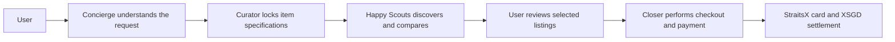
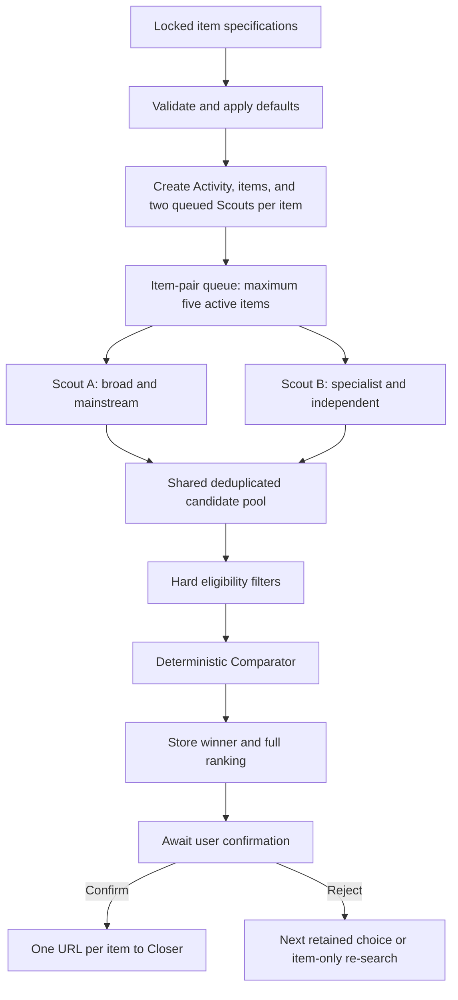

# Happy Scouts

Happy Scouts is the product-discovery and comparison subsystem for **Happy**, an AI shopping concierge built for the StraitsX AI Commerce Agents hackathon track.

It receives item requirements that have already been confirmed by the Curator, assigns two complementary research Scouts to every item, collects and validates product candidates, compares the shared candidate pool using deterministic code, streams real progress and browser imagery to the UI, and returns one confirmed shopping URL per item to the Closer.

> **Scope boundary:** this repository researches and compares products. It never issues cards, signs into merchant accounts, adds products to carts, enters payment information, or completes purchases. The separate Closer component owns checkout and StraitsX payment integration.

## Current status

The repository contains a complete local demonstration path and the core AWS adapters:

- Typed request, state, event, candidate, ranking, and Closer-handoff contracts.
- Two Scouts per item with complementary search strategies.
- Five-item and ten-Scout concurrency limits with queued overflow items.
- A truthful Scout state machine and sequenced progress events.
- One-to-three-candidate support; the current mock and AWS drivers normally target two per Scout.
- Candidate normalization, public-URL protection, deduplication, hard eligibility checks, and deterministic scoring.
- Retained top-three alternatives and item-scoped re-search after those alternatives are rejected.
- Lightweight Scout screenshots and support for AgentCore Browser Live View URLs.
- A Fastify HTTP/WebSocket API and a React developer harness.
- In-memory local adapters plus DynamoDB, S3, AgentCore Browser, Bedrock, and API Gateway WebSocket adapters.
- TypeScript CDK infrastructure for DynamoDB, S3, the WebSocket API/Lambda, and an AgentCore runtime IAM role.
- Automated tests, CI validation, and repository secret scanning.

The local demonstration is ready to run without AWS. A real AgentCore Browser run requires an AWS account, AgentCore Browser access, an enabled Bedrock model, and the deployed storage resources.

## Table of contents

- [Where Happy Scouts fits](#where-happy-scouts-fits)
- [How an Activity works](#how-an-activity-works)
- [Scout strategies and pipeline](#scout-strategies-and-pipeline)
- [Candidate comparison](#candidate-comparison)
- [Observability and Live View](#observability-and-live-view)
- [Repository structure](#repository-structure)
- [Runtime modes](#runtime-modes)
- [Local quick start](#local-quick-start)
- [Manual API walkthrough](#manual-api-walkthrough)
- [Testing the real AWS agent](#testing-the-real-aws-agent)
- [HTTP and WebSocket interfaces](#http-and-websocket-interfaces)
- [Testing and validation](#testing-and-validation)
- [Security model](#security-model)
- [Known limitations](#known-limitations)

## Where Happy Scouts fits



This repository starts at the Curator-to-Scouts handoff and ends at the Scouts-to-Closer handoff.

The important domain terms are:

| Term | Meaning |
|---|---|
| Activity | One complete Scout request containing one or more locked items. |
| Item | A product requirement such as “Sony WH-1000XM5, new, black, under S$500”. |
| Scout | One independent research worker. Every item receives exactly two. |
| Candidate | A normalized listing discovered by a Scout. |
| Comparison | Deterministic filtering and scoring of the shared candidate pool. |
| Selection | The highest-ranked eligible candidate for an item. |
| Closer handoff | The Activity ID and one confirmed shopping URL per item. |

## How an Activity works



The sequence is:

1. The Curator submits an Activity containing all locked item specifications.
2. Zod validates the request and supplies defaults such as quantity `1`, Singapore shipping, and the `best_overall` ranking preset.
3. The coordinator creates exactly two queued Scouts for every item.
4. At most five item pairs run at once, so no more than ten Scouts are active.
5. Each Scout discovers listings, analyzes evidence, and persists valid candidates.
6. Both Scouts contribute to one item-level candidate pool. Duplicate listings are removed.
7. The normal TypeScript Comparator applies hard filters, calculates scores, and stores the full ranking.
8. The UI displays the selected listing and waits for the user.
9. Confirmation marks the item complete. Rejection advances through retained alternatives.
10. When the first three choices have been rejected, only that item is searched again. Previously confirmed items remain untouched.
11. After every non-failed item is confirmed, Closer receives only the item IDs and selected URLs.

Every state mutation is persisted before its corresponding event is published. Idempotency keys prevent retrying a start request from creating duplicate Activities.

## Scout strategies and pipeline

Each item uses two deliberately different strategies:

| Scout | Strategy | Intended coverage |
|---|---|---|
| Scout A | `broad_mainstream` | Broad queries, mainstream marketplaces, and large retailers. |
| Scout B | `specialist_independent` | Specialist shops, independent sellers, and category-specific sources using different wording. |

In the current AWS driver, the initial attempt starts from Google Search. Recovery attempts rotate through Bing and DuckDuckGo. Search is isolated behind the Scout driver boundary so a dedicated search API can be introduced later.

The per-Scout pipeline is:

```text
Queued → Pending → Discovering → Analyzing → Gathering
                              ↑                 │
                              └─────────────────┘
          → Comparing → Selected
```

- **Queued:** the item is waiting for one of the five item slots.
- **Pending:** the item slot has been allocated and the Scout is starting.
- **Discovering:** the Scout searches or opens a new listing.
- **Analyzing:** it checks the locked specification and extracts evidence.
- **Gathering:** it normalizes, validates, deduplicates, and saves a candidate.
- **Gathering → Discovering:** the Scout loops back to find another candidate. This backward movement is genuine work, not UI animation.
- **Comparing:** both Scouts wait while their shared item pool is ranked.
- **Selected:** the item-level winner has been stored.

The contracts support one to three valid candidates per Scout. Both current drivers normally target two, producing up to four pooled listings before deduplication. A comparison with fewer than three candidates or only one source strategy is marked `lowCoverage`.

### Failure and recovery behavior

- A Scout operation has a six-minute timeout.
- The resilient driver makes the original attempt plus up to two backup attempts.
- Each backup attempt changes the search-source strategy.
- If one Scout fails but at least two valid pooled candidates remain, comparison may continue with `lowCoverage`.
- An item fails when fewer than two usable candidates remain after recovery.
- Screenshot or Live View failure is treated as an observability problem and does not fail research.
- Cancellation aborts active Scout work and prevents new queued work from starting.
- Browser sessions are stopped in `finally` blocks.

## Candidate comparison

Bedrock does not decide the winning listing. The model is limited to turning messy page evidence into validated structured data, summarizing review evidence, classifying seller/listing signals, and producing explanatory text. Final filtering and arithmetic are ordinary TypeScript.

### Candidate data

Internally, a candidate can contain:

- Canonical listing URL, merchant, seller, product title, variant, and quantity.
- Item price, shipping, total known price, and currency.
- Stock and shipping eligibility.
- Specification-match result and mismatch reasons.
- Rating, review count, summarized sentiment, and recurring complaints.
- Seller reputation, listing consistency, and external corroboration.
- Red flags and explicit score penalties.
- Evidence completeness, source strategy, discovery time, and Scout identity.

Candidates are deduplicated by canonical URL, merchant, seller, and product variant. The same product offered by different sellers remains a separate candidate.

### Hard eligibility filters

A candidate is ineligible when any of these conditions apply:

- The listing does not match the locked specification.
- The known total exceeds the user’s budget.
- The quantity is incorrect.
- The item is out of stock.
- It cannot ship to the requested country.
- The merchant is rejected by payment-eligibility rules.
- It contains a critical listing-integrity red flag.
- Its calculated authenticity is below `50/100`.

Ineligible candidates remain in the internal ranking for traceability but cannot be selected.

### Ranking presets

| Preset | Price | Authenticity | Reviews |
|---|---:|---:|---:|
| `best_overall` | 40% | 35% | 25% |
| `lowest_price` | 60% | 25% | 15% |
| `trusted_seller` | 20% | 55% | 25% |
| `best_reviewed` | 20% | 25% | 55% |

The component calculations are:

- **Price:** `100 × lowestKnownTotal ÷ candidateKnownTotal`.
- **Authenticity:** seller reputation 50%, listing consistency 30%, external corroboration 20%, minus red-flag deductions.
- **Reviews:** Bayesian-adjusted star rating using a 50-review prior and the peer average, followed by a bounded sentiment adjustment.
- **Confidence:** evidence completeness 60%, candidate coverage 25%, and source diversity 15%.

Ties are resolved deterministically by confidence, total price, and then canonical URL. Re-running the Comparator with identical candidates always produces the same order.

## Observability and Live View

Progress events and browser imagery are separate channels. A broken screenshot service must not stop a Scout from completing its research.

### Lightweight tile imagery

- A screenshot is requested after meaningful browser actions.
- The coordinator caps accepted screenshots at one frame per second per Scout.
- The real browser driver adds a heartbeat screenshot every five seconds while idle.
- Local mode stores generated SVG snapshots in memory.
- AWS mode stores JPEGs in an encrypted S3 bucket.
- S3 screenshot objects expire after one day.
- Persistent state stores the object key, never an expired presigned URL.
- The snapshot endpoint either returns local bytes or redirects to a five-minute S3 URL.

### Expanded Live View

When a user expands a real active Scout, the API can request a five-minute AgentCore Browser Live View WebSocket URL. Video is connected directly between the UI and AgentCore; the application backend does not proxy the stream.

There is no permanent Live View link. A link can only be generated after a real AgentCore Browser session exists, and it should never be committed or logged. In local mock mode, `POST /v1/scouts/{scoutId}/live-view-url` correctly returns `503` because no real browser session exists.

### Event replay

Every Activity event receives a monotonically increasing sequence number. A client reconnects using its last received sequence:

```text
ws://localhost:3001/v1/events?activityId=demo-123&afterSequence=42
```

The server first replays stored events after sequence 42 and then streams new events. The developer harness deduplicates events by `eventId` and coalesces state refreshes instead of issuing one HTTP request per event.

## Repository structure

```text
.
├── apps/
│   ├── api/            Local Fastify HTTP and WebSocket control API
│   ├── harness/        Minimal React developer and observability UI
│   └── agentcore/      Real AgentCore Runtime-compatible HTTP process
├── packages/
│   ├── contracts/      Zod schemas and shared TypeScript contracts
│   ├── core/           State machine, URL safety, deduplication, Comparator
│   ├── runtime/        Coordinator, ports, in-memory adapters, mock Scout
│   └── aws/            DynamoDB, S3, Bedrock, Browser, and WebSocket adapters
├── infra/              TypeScript CDK stack
├── agentcore/          AgentCore runtime configuration
├── tests/              Contract, core, security, and coordinator tests
├── scripts/            Repository secret scanner
├── openapi.yaml        UI-facing HTTP contract
└── .env.example        Safe configuration template
```

The domain packages do not import the AWS SDK. AWS services are connected through interfaces from `@happy/runtime`, allowing the coordinator and Comparator to be tested without credentials.

## Runtime modes

There are currently two separate application entry points:

| Mode | Command | Browser | Model | Persistence | Intended use |
|---|---|---|---|---|---|
| Local mock | `pnpm dev` | Deterministic mock Scout | None | Memory | Fast development, UI integration, workflow testing |
| Real AWS agent | `pnpm --filter @happy/agentcore dev` | AgentCore Browser + Playwright/CDP | Bedrock | DynamoDB + S3 | Real merchant browsing and extraction smoke tests |

Important implementation detail: setting `SCOUT_MODE` does not currently switch the local Fastify API into AWS mode. `apps/api` intentionally wires the local mock adapters, while `apps/agentcore` wires the AWS adapters. `SCOUT_MODE=mock` is therefore descriptive configuration for the local service today.

### What local mock mode proves

- Request validation and defaults.
- Activity idempotency.
- Two Scouts per item.
- Ten-Scout concurrency and queued overflow.
- Real state transitions and event sequencing.
- Candidate gathering, deduplication, scoring, and selection.
- Screenshot delivery to all Scout tiles.
- Pause, resume, cancellation, failure isolation, confirmation, and handoff.
- Retained alternatives and item-scoped re-search.

### What local mock mode does not prove

- That Google or a merchant permits automated access.
- Real AgentCore Browser permissions or quotas.
- Bedrock model access and extraction accuracy.
- CAPTCHA, consent-banner, or anti-bot behavior.
- Whether selected merchants consistently expose price, seller, shipping, and review evidence.
- Full AgentCore Live View connectivity.

## Local quick start

### Requirements

- Node.js 22 or later.
- pnpm 10.14.0 or a compatible pnpm 10 release.

### Install and run

```bash
git clone <repository-url>
cd straitsxhackathonworkflowagent
cp .env.example .env
pnpm install
pnpm dev
```

Open:

- Developer harness: [http://localhost:5173](http://localhost:5173)
- API health check: [http://localhost:3001/health](http://localhost:3001/health)

Click **Start six-item demo** in the harness. A successful demonstration shows:

1. Six item rows and twelve Scout tiles.
2. Ten Scouts becoming active while the sixth item pair remains queued briefly.
3. Each active Scout moving through discovery, analysis, and gathering.
4. Lightweight imagery appearing in each Scout tile.
5. Both Scouts for an item entering comparison together.
6. Every item becoming selected.
7. The Activity reaching `awaiting_confirmation`.
8. Sequenced events appearing in the latest-events panel.

The local API runs on `127.0.0.1:3001` and Vite runs on `localhost:5173`. Change these through `.env` only when needed; never commit the resulting file.

## Manual API walkthrough

Start the local services first:

```bash
pnpm dev
```

### 1. Start one Activity

```bash
curl -X POST http://localhost:3001/v1/scout-runs \
  -H 'content-type: application/json' \
  -H 'idempotency-key: manual-test-1' \
  -d '{
    "activityId": "manual-test-1",
    "items": [{
      "itemId": "headphones",
      "name": "Sony WH-1000XM5",
      "specs": {
        "condition": "new",
        "colour": "black"
      },
      "quantity": 1,
      "priceCapSGD": 500,
      "rankingPreset": "best_overall",
      "shipToCountry": "SG",
      "locale": "en-SG"
    }]
  }'
```

The API returns `202 Accepted` immediately. Repeating the request with the same idempotency key returns the existing Activity instead of starting duplicate Scouts.

### 2. Read current state

```bash
curl http://localhost:3001/v1/scout-runs/manual-test-1
```

Wait until the Activity status is `awaiting_confirmation`. The item should contain two Scouts, normalized candidates, a full internal ranking, and one `selectedCandidateId`.

### 3. Reject a selection

```bash
curl -X POST \
  http://localhost:3001/v1/scout-runs/manual-test-1/items/headphones/reject \
  -H 'content-type: application/json' \
  -d '{"reason":"Show me another option"}'
```

The first two rejections advance to the second and third retained choices. Rejecting the third choice restarts only the headphones Scouts with an incremented item attempt while retaining useful non-rejected candidates.

### 4. Confirm the selected item

```bash
curl -X POST http://localhost:3001/v1/scout-runs/manual-test-1/confirm \
  -H 'content-type: application/json' \
  -d '{"itemIds":["headphones"]}'
```

When every non-failed item is confirmed, the Activity becomes `ready_for_closer`.

### 5. Read the Closer handoff

```bash
curl http://localhost:3001/v1/scout-runs/manual-test-1/closer-handoff
```

The result deliberately contains no scores, reviews, alternatives, browser sessions, or payment information:

```json
{
  "activityId": "manual-test-1",
  "selections": [
    {
      "itemId": "headphones",
      "url": "https://example.com/shop/..."
    }
  ]
}
```

Local mock URLs use `example.com`. A real AWS run should produce genuine public merchant URLs.

## Testing the real AWS agent

Use one item first. This keeps cost and browser usage low while exposing IAM, model-access, CAPTCHA, extraction, and merchant compatibility problems.

### Prerequisites

- AWS credentials available through the normal AWS SDK credential chain.
- Access to Bedrock and an enabled model in the selected region.
- AgentCore Browser access and permission to start, connect to, and stop browser sessions.
- CDK bootstrap completed for the AWS account and region.
- DynamoDB and S3 resources deployed from this repository.

Verify the active AWS identity before deploying:

```bash
aws sts get-caller-identity
```

### Configuration

Copy the safe template and replace placeholders only in the ignored `.env` file or your shell environment:

```bash
cp .env.example .env
```

| Variable | Required by | Purpose |
|---|---|---|
| `AWS_REGION` | AWS adapters | AWS region, default `ap-southeast-1`. |
| `HAPPY_AWS_REGION` | CDK | Region used when synthesizing/deploying the stack. |
| `BEDROCK_MODEL_ID` | Real Scout | Enabled Bedrock model used for structured extraction. |
| `AGENTCORE_BROWSER_ID` | Real Scout | Browser resource identifier, default `aws.browser.v1`. |
| `SCOUTS_TABLE_NAME` | Real Scout | DynamoDB table containing Activity state and events. |
| `SCOUTS_SCREENSHOT_BUCKET` | Real Scout | S3 bucket for short-lived screenshots. |
| `WEBSOCKET_MANAGEMENT_ENDPOINT` | Optional | Enables event publication to connected API Gateway clients. |
| `AGENTCORE_RUNTIME_ARN` | Runtime invoker adapter | ARN used when a separate control service invokes AgentCore Runtime. |
| `VITE_API_URL` | Harness | HTTP control API consumed by the UI. |
| `VITE_WS_URL` | Harness | Activity event WebSocket endpoint. |

Do not place real values in `.env.example`.

### Synthesize and deploy infrastructure

Review the CloudFormation template without changing AWS resources:

```bash
HAPPY_AWS_REGION=ap-southeast-1 pnpm --filter @happy/infra synth
```

Deploy after reviewing the synthesis:

```bash
HAPPY_AWS_REGION=ap-southeast-1 \
pnpm --filter @happy/infra exec cdk deploy
```

The current stack creates:

- One encrypted, pay-per-request DynamoDB table with point-in-time recovery and TTL support.
- One private encrypted S3 screenshot bucket with a one-day lifecycle.
- One API Gateway WebSocket API and connection-management Lambda.
- One IAM role for AgentCore Runtime with DynamoDB, S3, Bedrock, Browser, and WebSocket permissions.

The stack does **not** currently create the AgentCore Runtime resource, an HTTP API Gateway control service, Cognito/JWT authentication, or the teammate-owned production UI.

### Run the AWS-wired process locally

Build the workspace and start the AgentCore-compatible server:

```bash
pnpm build
pnpm --filter @happy/agentcore dev
```

The process listens on `0.0.0.0:8080` and exposes the AgentCore-compatible `/ping` and `/invocations` routes.

Start one real Activity:

```bash
curl -X POST http://localhost:8080/invocations \
  -H 'content-type: application/json' \
  -d '{
    "action": "start",
    "idempotencyKey": "aws-browser-test-1",
    "request": {
      "activityId": "aws-browser-test-1",
      "items": [{
        "itemId": "headphones",
        "name": "Sony WH-1000XM5",
        "specs": {
          "condition": "new",
          "colour": "black"
        },
        "priceCapSGD": 500,
        "shipToCountry": "SG"
      }]
    }
  }'
```

Check whether background work is still running:

```bash
curl http://localhost:8080/ping
```

- `HealthyBusy` means the coordinator is still working.
- `Healthy` means its in-process work has finished.

The AgentCore-compatible server does not expose the normal Activity `GET` route. Inspect the persisted state in DynamoDB:

```bash
aws dynamodb get-item \
  --table-name happy-scouts-state \
  --key '{"PK":{"S":"ACTIVITY#aws-browser-test-1"},"SK":{"S":"STATE"}}' \
  --consistent-read
```

Inspect screenshots in S3:

```bash
aws s3 ls s3://YOUR_SCREENSHOT_BUCKET/snapshots/aws-browser-test-1/ --recursive
```

A successful real run should show:

- Two Scout records for the item.
- Real public listing URLs instead of `example.com`.
- Normally two candidates gathered per successful Scout.
- An `awaiting_confirmation` Activity with one selected candidate.
- Screenshot objects in S3.
- Browser sessions stopped after the run.

### Can the browser be tested without Bedrock?

The complete local workflow can be tested without Bedrock by running `pnpm dev`. The current real AWS driver, however, combines AgentCore Browser navigation with Bedrock extraction and requires `BEDROCK_MODEL_ID` when the first listing is analyzed.

There is not yet a standalone browser-only smoke command that starts AgentCore Browser, navigates from Google to a merchant such as Shopee, prints a Live View URL, and substitutes fixture extraction. Adding that mode is the cleanest way to test real navigation independently of model access. Do not use a fake model ID; the extraction call will fail.

Google, Shopee, and other merchants may display CAPTCHAs, consent dialogs, regional blocks, or automation challenges. The Scout must report or surface these conditions and must not attempt to bypass them.

## HTTP and WebSocket interfaces

The full schema is in [`openapi.yaml`](./openapi.yaml). The primary routes are:

| Method | Route | Purpose |
|---|---|---|
| `POST` | `/v1/scout-runs` | Start or idempotently return an Activity. |
| `GET` | `/v1/scout-runs/{activityId}` | Read complete current state. |
| `POST` | `/v1/scout-runs/{activityId}/pause` | Pause active work at safe callback boundaries. |
| `POST` | `/v1/scout-runs/{activityId}/resume` | Resume paused work. |
| `POST` | `/v1/scout-runs/{activityId}/cancel` | Cancel incomplete work. |
| `POST` | `/v1/scout-runs/{activityId}/items/{itemId}/reject` | Select a retained alternative or restart that item. |
| `POST` | `/v1/scout-runs/{activityId}/confirm` | Confirm selected item IDs. |
| `GET` | `/v1/scout-runs/{activityId}/closer-handoff` | Return the confirmed URLs for Closer. |
| `GET` | `/v1/scouts/{scoutId}/snapshot` | Return or redirect to the latest Scout image. |
| `POST` | `/v1/scouts/{scoutId}/live-view-url` | Generate a short-lived real-browser Live View URL. |
| WebSocket | `/v1/events` | Replay and stream Activity events. |

### Start request

```ts
type StartScoutRunRequest = {
  activityId: string;
  items: Array<{
    itemId: string;
    name: string;
    specs: Record<string, string>;
    quantity?: number; // default 1
    priceCapSGD?: number;
    rankingPreset?:
      | "best_overall"
      | "lowest_price"
      | "trusted_seller"
      | "best_reviewed"; // default best_overall
    shipToCountry?: string; // default SG
    locale?: string; // default en-SG
  }>;
};
```

### Event envelope

```ts
type ActivityEvent<T> = {
  schemaVersion: 1;
  eventId: string;
  sequence: number;
  type: string;
  activityId: string;
  itemId?: string;
  scoutId?: string;
  attempt: number;
  timestamp: string;
  payload: T;
};
```

Core event types cover Activity controls, item queueing and selection, Scout stages and failures, snapshots, accepted/rejected candidates, and comparison start/completion.

### Closer handoff

Closer only receives:

```ts
type CloserHandoff = {
  activityId: string;
  selections: Array<{
    itemId: string;
    url: string;
  }>;
};
```

The handoff is unavailable until every non-failed item has been explicitly confirmed.

## Testing and validation

Install dependencies once:

```bash
pnpm install
```

Run the complete local validation suite:

```bash
pnpm validate
```

This executes:

1. Repository secret scanning.
2. TypeScript typechecking across the workspace.
3. Vitest tests.
4. Production builds for every package and application.

Individual commands:

```bash
pnpm typecheck
pnpm test
pnpm test:watch
pnpm build
pnpm secrets:check
```

The current tests cover:

- Request defaults and duplicate item validation.
- Valid and invalid Scout state transitions.
- The intentional `Gathering → Discovering` loop.
- Public URL validation and private-network blocking.
- Prompt-injection framing for untrusted webpage content.
- Hard comparison filters, authenticity calculations, presets, and deterministic ordering.
- Six submitted items, twelve Scout records, and the ten-Scout limit.
- Event sequencing and replay.
- Idempotent starts.
- Candidate retention, top-three rejection, and item-only re-search.
- One-Scout failure and low-coverage selection.
- Screenshot-service failure remaining non-fatal.
- Confirmation and Closer handoff.

Before staging or committing any change, run:

```bash
pnpm secrets:check
```

## Security model

### Web content is untrusted

- Extracted page text is wrapped and sent to the model as data, never as instructions.
- Page-originated requests to change the goal or invoke tools are ignored.
- Model-produced candidates must pass the Zod schema before persistence.
- Only public HTTP and HTTPS URLs are allowed.
- Localhost, loopback addresses, private networks, `file:` URLs, and executable schemes are blocked.
- Logs redact authorization headers, cookies, and credential-shaped fields.

### Scouts are research-only

Allowed actions:

- Search.
- Navigate to public pages.
- Read and extract listing evidence.
- Capture screenshots.

Disallowed actions:

- Logging into merchant accounts.
- Adding products to carts.
- Entering payment, wallet, card, or identity information.
- Requesting StraitsX cards.
- Downloading or executing files.
- Submitting purchases.

### Public repository rules

- `.env` and `.env.*` are ignored; only `.env.example` is allowed.
- AWS credentials, StraitsX keys, wallet material, real private keys, production tokens, and presigned URLs must never be committed.
- Generated deployments, logs, browser recordings, screenshots, local databases, and local AWS files are ignored.
- CI runs the repository secret scanner and fails on detected credential patterns.
- If `aa-probe/` test-key fixtures appear, scanner exceptions must target exact reviewed fixtures or fingerprints, never the whole directory.

## Known limitations

- The production UI is owned by another teammate; this repository contains only a diagnostic harness.
- The CDK stack does not yet deploy the HTTP control API, Cognito authorizer, or AgentCore Runtime resource.
- The real AgentCore process requires a Bedrock model ID; browser-only smoke testing is not yet exposed as a command.
- The current real search implementation relies on public search-result pages and may encounter CAPTCHA or anti-bot controls.
- Search-result link extraction is intentionally simple and should be hardened for the two or three merchants selected for the judging demonstration.
- Merchant-payment eligibility currently defaults to true until Closer provides an adapter or rule set.
- The current drivers normally gather two candidates per Scout rather than dynamically increasing to three when confidence is low or scores are close.
- The normal local API and the real AWS process are separate entry points; a production control-plane integration still needs to connect them.
- Actual AWS deployment and merchant smoke testing require external credentials, quotas, and model access.

## Troubleshooting

### `pnpm dev` starts but the harness is empty

Check the API directly:

```bash
curl http://localhost:3001/health
```

Confirm `VITE_API_URL` and `VITE_WS_URL` point to the local API and restart `pnpm dev` after changing `.env`.

### Live View returns `503`

This is expected in local mock mode. A Live View URL exists only for an active real AgentCore Browser session.

### The real process exits during startup

Check that `BEDROCK_MODEL_ID`, `SCOUTS_TABLE_NAME`, and `SCOUTS_SCREENSHOT_BUCKET` contain real values and do not still begin with `replace-with`.

### A real Scout fails before gathering candidates

Check:

- AWS identity and region.
- Bedrock model access.
- AgentCore Browser IAM permissions and service availability.
- DynamoDB table and S3 bucket names.
- Search-engine or merchant CAPTCHA/consent pages.
- CloudWatch or structured process logs for the first failed navigation or extraction.

### The Closer handoff returns `409`

The Activity must be `ready_for_closer`. Read the Activity state and confirm every selected item first.

## Further documentation

- [Product and team context](./CONTEXT.md)
- [Approved implementation plan](./SCOUTS_IMPLEMENTATION_PLAN.md)
- [System design](./SYSTEM_DESIGN.md)
- [Non-technical walkthrough](./WALKTHROUGH.md)
- [OpenAPI contract](./openapi.yaml)
- [Project instructions](./AGENTS.md)
