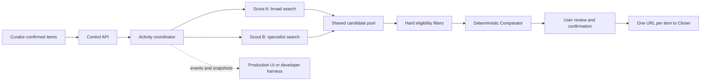

# Happy Scouts

Happy Scouts is the product-discovery and comparison backend for **Happy**, a chat-first AI shopping concierge built for the StraitsX AI Commerce Agents hackathon track.

It accepts product requirements that have already been confirmed by the user, assigns two complementary Scouts to each item, collects and validates shopping candidates, compares the shared candidate pool deterministically, streams truthful progress to the UI, and produces one confirmed shopping URL per item for the Closer service.

> **Important boundary:** this repository researches and compares products. It never signs in to merchant accounts, adds products to a cart, issues cards, enters payment information, performs checkout, or settles XSGD payments. Those responsibilities belong to Closer.

## Current status

The repository has two deliberately different execution surfaces:

- `pnpm dev` runs deterministic mock Scouts for coordinator, contract, UI, comparison, and Closer-handoff testing. It never visits a real website.
- `@happy/agentcore` is the only real-agent runtime. It uses AgentCore Runtime, one AgentCore Browser session per active Scout, Playwright over CDP, Amazon Bedrock for structured evidence extraction, DynamoDB for state, and S3 for snapshots.

There is no local Playwright, Browserbase, browser-use, Ollama, or other non-AWS real-agent fallback. Real webpage testing requires AWS credentials, an enabled Bedrock model, and AgentCore access.

## Contents

- [What Happy Scouts owns](#what-happy-scouts-owns)
- [How the workflow works](#how-the-workflow-works)
- [Scout strategies and pipeline](#scout-strategies-and-pipeline)
- [Candidate comparison](#candidate-comparison)
- [Observability](#observability)
- [Runtime modes](#runtime-modes)
- [Quick start](#quick-start)
- [Manual API walkthrough](#manual-api-walkthrough)
- [Testing](#testing)
- [Real AWS agent](#real-aws-agent)
- [Repository structure](#repository-structure)
- [Security](#security)
- [Known limitations](#known-limitations)

## What Happy Scouts owns

Happy is divided into four conceptual stages:

```text
Concierge -> Curator -> Scouts -> Closer
```

- **Concierge** understands the shopping goal.
- **Curator** confirms the exact item specifications, budget, quantity, and delivery requirements.
- **Scouts**, implemented in this repository, discover and compare listings.
- **Closer**, owned by another teammate, receives confirmed shopping URLs and handles the purchasing workflow.

The handoff boundary is intentionally small:

```ts
type CloserHandoff = {
  activityId: string;
  selections: Array<{
    itemId: string;
    url: string;
  }>;
};
```

Closer does not receive browser sessions, scoring internals, prompts, rejected alternatives, credentials, or payment data.

## Core concepts

| Term | Meaning |
|---|---|
| Activity | One complete multi-item shopping research request. |
| Item | One locked product requirement within an Activity. |
| Scout | One research worker. Every item receives exactly two Scouts. |
| Candidate | A normalized merchant listing collected by a Scout. |
| Comparator | Deterministic TypeScript code that filters and ranks the shared candidate pool. |
| Selection | The highest-ranked eligible candidate for an item. |
| Event | A versioned, sequenced record of real workflow progress. |
| Snapshot | Optional internal evidence or diagnostic imagery from a Scout browser. |
| Live View | A read-only direct DCV view into an active managed browser session. |

## How the workflow works



The end-to-end sequence is:

1. Curator submits all locked items in one request.
2. The API validates the request with Zod.
3. The coordinator creates two queued Scouts for each item.
4. Up to five item pairs run concurrently, which means at most ten active Scouts.
5. Overflow item pairs remain visible as `queued` and do not consume browser sessions.
6. Each Scout searches with a different strategy and normally gathers two candidates.
7. Candidates are normalized, URL-checked, deduplicated, validated, and persisted.
8. The two Scouts enter `comparing` together.
9. The Comparator applies hard filters, calculates scores, and stores the complete ranking.
10. The user reviews one selected listing per item.
11. Confirming every non-failed item changes the Activity to `ready_for_closer`.
12. Closer retrieves one item-associated URL per confirmed item.

Every state mutation is persisted before its corresponding event is published. This lets a reconnecting UI rebuild the same state from event replay.

## Scout strategies and pipeline

Every item receives two complementary Scouts:

| Scout | Strategy | Intended coverage |
|---|---|---|
| Scout A | `broad_mainstream` | Broad queries, large retailers, mainstream marketplaces, and familiar merchants. |
| Scout B | `specialist_independent` | Specialist retailers, independent sellers, category-specific merchants, and alternate query wording. |

The real AWS driver selects Google, Bing, or DuckDuckGo based on the current recovery attempt. It extracts safe public links from search results, opens candidate pages with Playwright, and asks Bedrock to turn untrusted page text into a validated candidate object.

### Scout state machine

```text
Queued -> Pending -> Discovering -> Analyzing -> Gathering
                              ^                    |
                              |--------------------|
                         another candidate

Gathering -> Comparing -> Selected
```

- `queued`: waiting for one of five item slots.
- `pending`: assigned a slot but not yet navigating.
- `discovering`: searching or opening a potential listing.
- `analyzing`: checking specifications, seller evidence, reviews, stock, delivery, and red flags.
- `gathering`: validating and saving an eligible normalized candidate.
- `comparing`: both Scouts have completed and the shared pool is being ranked.
- `selected`: the item-level winning candidate has been stored.
- `failed`: recovery was exhausted for that Scout or item.
- `cancelled`: the Activity was cancelled before completion.

`Gathering -> Discovering` is a real transition, not a visual animation. It means the Scout saved one candidate and returned to the web to find another.

### Candidate coverage

The domain supports one to three candidates per Scout. The current mock and AWS drivers normally target two candidates each, giving up to four candidates before deduplication.

- A normal comparison should contain at least three unique candidates from both strategies.
- Comparison may continue with two candidates only after recovery is exhausted.
- A selection from fewer than three candidates or only one source strategy is marked `lowCoverage`.
- An item fails if fewer than two usable candidates remain.

### Recovery

Each Scout run is wrapped by `ResilientScoutDriver`:

- One initial attempt.
- Up to two backup attempts.
- Six-minute timeout per attempt wrapper.
- Cancellation propagated with `AbortSignal`.
- Browser sessions stopped in `finally` blocks.

If one Scout fails but the other provides at least two usable candidates, the item can still be selected with `lowCoverage: true`.

## Candidate comparison

The language model does not choose the winner. It may extract evidence, summarize reviews, and classify listing risks, but the final filtering and arithmetic are ordinary deterministic TypeScript.

### Hard filters

A candidate becomes ineligible when any of the following apply:

- Confirmed specification mismatch.
- Price above the user-defined cap.
- Incorrect quantity.
- Out of stock.
- Cannot ship to the requested country.
- Merchant rejected by the payment-eligibility field.
- Critical listing red flag.
- Authenticity score below 50/100.

### Scores

Price score:

```text
100 * lowest known total / candidate known total
```

Authenticity score:

```text
seller reputation       50%
listing consistency     30%
external corroboration  20%
- explicit red-flag penalties
```

Review score uses a Bayesian-adjusted rating with a 50-review prior, the peer-average rating, and a bounded sentiment adjustment. Missing review data receives a conservative score of 40.

Confidence combines:

- Evidence completeness: 60%.
- Candidate coverage: 25%.
- Source diversity: 15%.

### Ranking presets

| Preset | Price | Authenticity | Reviews |
|---|---:|---:|---:|
| `best_overall` | 40% | 35% | 25% |
| `lowest_price` | 60% | 25% | 15% |
| `trusted_seller` | 20% | 55% | 25% |
| `best_reviewed` | 20% | 25% | 55% |

Ties are broken deterministically by confidence, total price, and finally canonical URL.

### Deduplication

Tracking parameters are removed from listing URLs. Candidates are deduplicated using their canonical URL, merchant, seller, and product variant. The same product sold by different sellers remains a separate candidate.

## Confirmation and rejection

When every searchable item is selected, the Activity becomes `awaiting_confirmation`.

Confirming an item freezes that selection. When all non-failed items are confirmed, the Activity becomes `ready_for_closer` and the minimal Closer handoff becomes available.

When a user rejects a selected candidate:

1. The candidate ID and rejection reason are retained.
2. The next unused candidate within the first three ranked choices is selected immediately.
3. After the first three choices are exhausted, only that item's Scouts restart.
4. Existing useful candidates remain stored.
5. Rejected candidate IDs are excluded from the next comparison.
6. Confirmed items and unrelated Scouts remain untouched.

## Observability

Progress events and browser imagery are deliberately separate. A screenshot or Live View failure must not terminate a Scout.

### Events

Every event contains:

```ts
type ActivityEvent<T> = {
  schemaVersion: 1;
  eventId: string;
  sequence: number;
  type: string;
  activityId: string;
  itemId?: string;
  scoutId?: string;
  attempt: number;
  timestamp: string;
  payload: T;
};
```

Sequence numbers are scoped to an Activity. WebSocket clients reconnect with their last observed sequence and receive missed events before new live events.

### Diagnostic snapshots

- Optional and retained only for internal evidence or diagnostics.
- Local snapshots remain in memory.
- AWS snapshots are encrypted in S3 and expire after one day.
- Persistent state stores object keys, never expired presigned URLs.

### Live View

AgentCore Live View is the primary browser feed for every active production Scout. The website receives a stable viewer URL whose fragment contains an opaque capability, never a presigned AgentCore URL. The viewer exchanges that fragment through `POST /v1/live-view/connection`, renders AWS `BrowserLiveView` at the session's 1280×720 viewport, and refreshes its short-lived signed connection when needed. DCV video then travels directly from AgentCore to the user's browser rather than through Happy's backend.

The viewer blocks pointer, keyboard, and focus interaction. Its host must emit a CSP `frame-ancestors` directive restricted to configured Happy frontend origins. The capability is revoked when the browser session ends. Local mock mode has no real browser session and therefore exposes no fabricated feed.

## Runtime modes

| Surface | Purpose | Browser | Model | State and imagery |
|---|---|---|---|---|
| Local mock | Unit, coordinator, contract, and UI-harness testing | Synthetic snapshots only | Deterministic fixtures | In-memory |
| AWS AgentCore | The only real-agent path | AgentCore Browser driven by Playwright/CDP | Amazon Bedrock | DynamoDB and encrypted S3 |

`pnpm dev` always runs the mock surface. Environment variables cannot turn it into a real browser. The real AWS process is the separate `@happy/agentcore` application in `apps/agentcore`.

This separation prevents a successful mock demo from being mistaken for proof that live merchant discovery works. A real smoke test must be executed in AWS and must show an AgentCore Browser session navigating actual pages.

## Quick start

### Requirements

- Node.js 22 or newer.
- pnpm 10.14.0.

### Install and run

```bash
cp .env.example .env
pnpm install
pnpm dev
```

Open:

- Developer harness: [http://localhost:5173](http://localhost:5173)
- API health: [http://localhost:3001/health](http://localhost:3001/health)

Click **Start six-item demo** in the harness.

You should see:

- Six item rows and twelve Scout tiles.
- At most ten active Scouts.
- The sixth item pair initially queued.
- Genuine stage changes.
- Lightweight browser-like snapshots.
- Comparison events and selected items.
- Final Activity status `awaiting_confirmation`.

This proves the application workflow. It does not prove that Google, Shopee, or another real merchant can be browsed and extracted successfully.

## Manual API walkthrough

The complete OpenAPI description is in [`openapi.yaml`](./openapi.yaml).

### Start one item

```bash
curl -X POST http://localhost:3001/v1/scout-runs \
  -H 'content-type: application/json' \
  -H 'idempotency-key: demo-key-1' \
  -d '{
    "activityId": "demo-activity-1",
    "items": [{
      "itemId": "gpu-1",
      "name": "Graphics card",
      "specs": {
        "memory": "16 GB",
        "use": "1440p gaming"
      },
      "quantity": 1,
      "priceCapSGD": 800,
      "rankingPreset": "best_overall",
      "shipToCountry": "SG",
      "locale": "en-SG"
    }]
  }'
```

The API responds with `202 Accepted`. The same idempotency key returns the existing Activity rather than creating another one.

### Read current state

```bash
curl http://localhost:3001/v1/scout-runs/demo-activity-1
```

### Pause, resume, or cancel

```bash
curl -X POST http://localhost:3001/v1/scout-runs/demo-activity-1/pause
curl -X POST http://localhost:3001/v1/scout-runs/demo-activity-1/resume
curl -X POST http://localhost:3001/v1/scout-runs/demo-activity-1/cancel
```

### Reject a selection

```bash
curl -X POST http://localhost:3001/v1/scout-runs/demo-activity-1/items/gpu-1/reject \
  -H 'content-type: application/json' \
  -d '{"reason":"I prefer a more established seller"}'
```

### Confirm a selection

```bash
curl -X POST http://localhost:3001/v1/scout-runs/demo-activity-1/confirm \
  -H 'content-type: application/json' \
  -d '{"itemIds":["gpu-1"]}'
```

### Retrieve the Closer handoff

```bash
curl http://localhost:3001/v1/scout-runs/demo-activity-1/closer-handoff
```

Expected shape:

```json
{
  "activityId": "demo-activity-1",
  "selections": [
    {
      "itemId": "gpu-1",
      "url": "https://example.com/shop/example-listing"
    }
  ]
}
```

### WebSocket replay

Connect to:

```text
ws://localhost:3001/v1/events?activityId=demo-activity-1&afterSequence=0
```

After reconnecting, replace `0` with the last sequence the client processed. The harness tracks this automatically and coalesces state refreshes instead of fetching once per event.

## HTTP API summary

| Method | Path | Purpose |
|---|---|---|
| `POST` | `/v1/runs/search` | Accept the website `RemoteAgentProvider` request and begin background discovery. |
| `POST` | `/v1/runs/{activityId}/pause` | Pause the website-integrated run. |
| `POST` | `/v1/runs/{activityId}/resume` | Resume the website-integrated run. |
| `POST` | `/v1/runs/{activityId}/cancel` | Cancel the website-integrated run. |
| `POST` | `/v1/runs/{activityId}/reject` | Advance or re-search a rejected website listing. |
| `POST` | `/v1/live-view/connection` | Exchange an active opaque capability for a fresh signed DCV connection. |
| `POST` | `/v1/scout-runs` | Start or idempotently return an Activity. |
| `GET` | `/v1/scout-runs/{activityId}` | Read complete current state. |
| `POST` | `/v1/scout-runs/{activityId}/pause` | Pause future Scout actions. |
| `POST` | `/v1/scout-runs/{activityId}/resume` | Resume a paused Activity. |
| `POST` | `/v1/scout-runs/{activityId}/cancel` | Cancel incomplete work. |
| `POST` | `/v1/scout-runs/{activityId}/items/{itemId}/reject` | Reject the current item selection. |
| `POST` | `/v1/scout-runs/{activityId}/confirm` | Confirm selected item IDs. |
| `GET` | `/v1/scout-runs/{activityId}/closer-handoff` | Retrieve confirmed URLs. |
| `GET` | `/v1/scouts/{scoutId}/snapshot` | Return or redirect to the latest snapshot. |
| `GET WS` | `/v1/events` | Replay and stream Activity events. |

## Testing

### Full validation

```bash
pnpm validate
```

This runs:

1. Repository secret scan.
2. TypeScript checks for all workspace packages.
3. Vitest test suite.
4. Production builds.

### Individual commands

```bash
pnpm typecheck
pnpm test
pnpm test:watch
pnpm build
pnpm secrets:check
```

### Covered behaviour

The tests currently cover:

- Request defaults and validation.
- Duplicate item rejection.
- Valid and invalid Scout transitions.
- `Gathering -> Discovering` candidate loop.
- URL canonicalization and private-network blocking.
- Untrusted-page-content framing.
- Authenticity calculation and thresholds.
- Every ranking preset and deterministic ranking.
- Six items creating twelve Scouts with no more than ten active.
- Candidate pooling and event replay.
- Idempotent Activity creation.
- Retained alternatives and item-scoped re-search.
- One-Scout failure with low-coverage selection.
- Non-fatal screenshot storage failure.
- Website `RemoteAgentProvider` request and callback compatibility.
- Authenticated, byte-identical callback retries and serialized item progress.
- Stable viewer capabilities, signed-connection refresh, and revocation.
- Confirmation and Closer handoff.

## Real AWS agent

### How AgentCore receives this repository

AgentCore Runtime does not clone the GitHub repository and does not need a GitHub token. Deployment starts from a trusted local checkout or CI checkout:

```text
Public GitHub repository -> trusted checkout -> AgentCore CLI
  -> remote Linux ARM64 container build -> ECR image -> AgentCore Runtime
```

The committed [`Dockerfile`](./Dockerfile) builds only the AgentCore application and its four workspace dependencies. `.dockerignore` excludes Git history, local dependencies, build output, `.env` files, and unrelated applications. `pnpm agentcore:configure` copies those safe inputs into a gitignored `.agentcore-project/` staging directory and generates the official AgentCore CLI configuration from [`agentcore.template.json`](./agentcore/agentcore.template.json). Deployment-specific account, role, model, and bucket values never overwrite a tracked file.

### What is implemented

- AgentCore Runtime-compatible HTTP server with `/ping` and `/invocations`.
- One AgentCore Browser session per active Scout.
- Playwright connection over a presigned CDP WebSocket URL.
- Bedrock `Converse` extraction validated through `CandidateSchema`.
- DynamoDB Activity and event storage with optimistic versions.
- Optional S3 diagnostic screenshot storage and five-minute presigned reads.
- API Gateway WebSocket connection tracking and publishing.
- Stable opaque viewer URLs with fresh five-minute AgentCore Live View exchanges.
- CDK resources for DynamoDB, S3, the WebSocket API, its connection Lambda, and runtime IAM.

### AWS services and access required

Both Bedrock and Bedrock AgentCore are required; they solve different parts of the workflow:

- **AgentCore Runtime** hosts the asynchronous Activity coordinator.
- **AgentCore Browser** creates the isolated browser sessions and temporary Live View streams.
- **Amazon Bedrock Runtime** invokes the configured model to extract candidate evidence from page text.
- **DynamoDB** stores Activities and replayable events.
- **S3** stores encrypted, one-day Scout snapshots.
- **API Gateway WebSocket and Lambda** distribute Activity events.
- **IAM and CloudWatch** provide runtime permissions, logs, and operational visibility.

Before attempting a real run, verify the AWS identity and region, confirm model access, and confirm that the assigned role can use AgentCore Browser and the supporting services. An Organizations service-control-policy explicit deny cannot be fixed by adding permissions to the role; the hackathon AWS administrator must change the SCP or provide a compatible pre-created AgentCore environment.

### What is not provisioned automatically

- The CDK stack does not create AgentCore Runtime; `pnpm agentcore:deploy` creates or updates it through the AgentCore CLI.
- A production HTTP control-API Lambda/API Gateway integration.
- Cognito or another production JWT authorizer.
- Bedrock model access.
- Merchant-specific smoke-test fixtures.
- Production UI deployment.

### Required configuration

Never commit the real values. Store them in `.env`, the deployment environment, CDK parameters, or AWS Secrets Manager.

| Variable | Purpose |
|---|---|
| `AWS_REGION` | Runtime AWS region; defaults to `ap-southeast-1`. |
| `HAPPY_AWS_REGION` | CDK synthesis/deployment region. |
| `HAPPY_AWS_ACCOUNT_ID` | Optional 12-digit target account. When absent, configuration calls `aws sts get-caller-identity`. |
| `BEDROCK_MODEL_ID` | Enabled model used for structured listing extraction. |
| `AGENTCORE_BROWSER_ID` | AgentCore Browser identifier; default placeholder is `aws.browser.v1`. |
| `AGENTCORE_RUNTIME_ROLE_ARN` | Existing CDK-created execution role with Bedrock, AgentCore Browser, DynamoDB, S3, and WebSocket permissions. |
| `SCOUTS_TABLE_NAME` | DynamoDB state table. |
| `SCOUTS_SCREENSHOT_BUCKET` | S3 bucket for Scout snapshots. |
| `WEBSOCKET_MANAGEMENT_ENDPOINT` | Optional API Gateway management endpoint for event publishing. |
| `AGENTCORE_RUNTIME_ARN` | Runtime identifier used by the invocation adapter/control plane. |
| `SCOUT_VIEWER_BASE_URL` | Public HTTPS origin hosting the read-only `/live` viewer. |
| `HAPPY_FRONTEND_ORIGINS` | Space-separated frontend origins allowed by viewer `frame-ancestors` CSP. |

### Configure and deploy from this checkout

Install dependencies and validate the code first:

```bash
pnpm install
pnpm validate
pnpm --filter @happy/agentcore build
HAPPY_AWS_REGION=ap-southeast-1 pnpm --filter @happy/infra synth
```

Deploy the supporting CDK stack using the hackathon account's approved process. Record these stack outputs:

- `StateTableName`
- `ScreenshotBucketName`
- `WebSocketManagementEndpoint`
- `AgentCoreRuntimeRoleArn`

Put those values and the enabled Bedrock model ID in your uncommitted `.env` or shell environment. Then generate the account-specific AgentCore files:

```bash
set -a
source .env
set +a
pnpm agentcore:configure
pnpm agentcore:validate
pnpm agentcore:dry-run
pnpm agentcore:deploy
```

`agentcore:configure` creates `.agentcore-project/agentcore/agentcore.json` and `.agentcore-project/agentcore/aws-targets.json` with mode `0600`, alongside only the source files required by the container build. The entire staging directory is gitignored. `agentcore:validate` checks the generated project schema. The dry run previews the deployment; the final command remotely builds the Node.js 22 container for Linux ARM64 and creates or updates AgentCore Runtime.

The deployment uses `networkMode: PUBLIC`, so no VPC IDs are configured. If the CLI or AWS environment still fails on an explicit Organizations SCP deny such as `ec2:DescribeVpcs`, only the hackathon AWS administrator can remove that deny or provide an allowed deployment path.

After deployment, invoke the runtime through AgentCore with a validated start payload and open the stable Scout viewer URL for an active Scout. The viewer obtains signed AgentCore connections at runtime; never place capabilities or presigned URLs in committed configuration.

### Current Bedrock dependency

The real `BedrockBrowserScoutDriver` requires `BEDROCK_MODEL_ID` during startup. A dummy value will not work: the first `Converse` extraction call will fail.

Without Bedrock you can still test the complete mock workflow. You cannot currently run the real AgentCore Browser driver through its normal application path without also configuring Bedrock.

## Repository structure

```text
.
├── apps/
│   ├── agentcore/       # Real AgentCore Runtime-compatible process
│   ├── api/             # Mock-only Fastify API for workflow/UI testing
│   └── harness/         # Minimal React diagnostic UI
├── packages/
│   ├── aws/             # DynamoDB, S3, AgentCore Browser, Bedrock, WebSocket adapters
│   ├── contracts/       # Zod schemas and public TypeScript types
│   ├── core/            # State machine, URL security, dedupe, deterministic scoring
│   └── runtime/         # Coordinator, ports, mock drivers, in-memory adapters
├── infra/               # TypeScript CDK stack
├── tests/               # Unit and coordinator integration tests
├── agentcore/           # Safe AgentCore templates
├── .agentcore-project/  # Generated deployment context; always gitignored
├── Dockerfile           # Remote Linux ARM64 AgentCore container build
├── openapi.yaml         # HTTP contract for UI and Closer integration
├── CONTEXT.md           # Product and team decisions
├── SYSTEM_DESIGN.md     # Architecture and state design
├── WALKTHROUGH.md       # Non-technical product explanation
└── SCOUTS_IMPLEMENTATION_PLAN.md
```

The central dependency rule is:

```text
contracts <- core <- runtime <- API/application
                           ^
                           |
                       AWS adapters
```

Domain code in `@happy/core` must never import AWS SDK packages.

## Security

### Untrusted webpage content

All merchant and search-engine content is treated as data, never as agent instruction.

- Page-originated requests to change goals or invoke tools are ignored.
- Model output is parsed and validated with Zod before storage.
- Navigation permits only public HTTP and HTTPS URLs.
- Localhost, private IP addresses, file URLs, and executable schemes are blocked.
- Page text never receives environment variables, AWS credentials, system prompts, or internal instructions.

### Restricted Scout actions

Scouts may:

- Search.
- Navigate.
- Read.
- Extract evidence.
- Capture screenshots.

Scouts may not:

- Authenticate.
- Add to cart.
- Download files.
- Request cards.
- Enter addresses, credentials, or payment information.
- Submit purchases.

### Public repository rules

- `.env` and `.env.*` are ignored.
- Only `.env.example` may be committed from the `.env` family.
- AWS credentials, StraitsX secrets, wallet keys, production URLs with tokens, and presigned URLs must never be committed.
- Generated screenshots, recordings, logs, local databases, and CDK output are ignored.
- Run `pnpm secrets:check` before staging or committing.
- Secret findings must be investigated; repository history is never rewritten automatically.

## Known limitations

- The local API and harness are intentionally mock-only; all real webpage browsing requires AWS.
- Viewer URLs are stable only for the lifetime of an active Scout session; their opaque capabilities are revoked when that session closes.
- Google, Shopee, and other merchants have not yet been validated through an AWS smoke test.
- Search-result link extraction is intentionally simple and may be affected by consent pages, layout changes, bot protection, or CAPTCHAs.
- Merchant payment eligibility is currently supplied as a candidate field; the Closer-owned eligibility adapter is not integrated.
- CDK does not yet deploy the production HTTP control API, AgentCore Runtime, or authentication.
- Activity-wide 20-minute termination and abandoned-session cleanup are not yet separate scheduled infrastructure jobs.
- The production UI is owned by another teammate; this repository includes only a developer harness.

## Troubleshooting

### `pnpm dev` works, but no real websites appear

That is expected. The local API uses deterministic mock Scouts and exposes no fabricated browser feed.

### Live View is unavailable

That is expected in mock mode because no real browser session or viewer capability exists.

### `BEDROCK_MODEL_ID` contains the placeholder

The mock harness still works, but the AgentCore application rejects the placeholder during startup. Select a model enabled for your AWS account and region.

### A sixth item looks stuck in `queued`

This is expected while five item pairs are active. It begins after one active pair reaches `selected` or `failed`.

### An item is marked `lowCoverage`

Recovery completed with fewer than three unique candidates or only one successful source strategy.

### Browser extraction fails on a merchant

The Scout retries using backup search strategies. Persistent merchant-specific failures should be recorded and excluded from the final demo merchant set.

## Documentation

- [Product context](./CONTEXT.md)
- [Approved implementation plan](./SCOUTS_IMPLEMENTATION_PLAN.md)
- [System design](./SYSTEM_DESIGN.md)
- [Non-technical walkthrough](./WALKTHROUGH.md)
- [OpenAPI contract](./openapi.yaml)
- [Contributor and agent instructions](./AGENTS.md)

## Useful external references

- [AgentCore TypeScript Runtime](https://docs.aws.amazon.com/bedrock-agentcore/latest/devguide/runtime-get-started-cli-typescript.html)
- [AgentCore asynchronous agents](https://docs.aws.amazon.com/bedrock-agentcore/latest/devguide/runtime-long-run.html)
- [AgentCore Browser](https://docs.aws.amazon.com/bedrock-agentcore/latest/devguide/browser-tool.html)
- [AgentCore Browser Live View](https://docs.aws.amazon.com/bedrock-agentcore/latest/devguide/browser-dcv-integration.html)
- [Amazon Bedrock model access](https://docs.aws.amazon.com/bedrock/latest/userguide/model-access.html)

## License

No license has been added yet. Treat the repository as source-available for the hackathon until the team chooses and commits a license.
