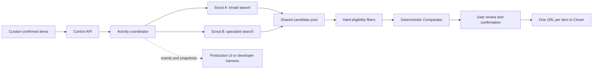
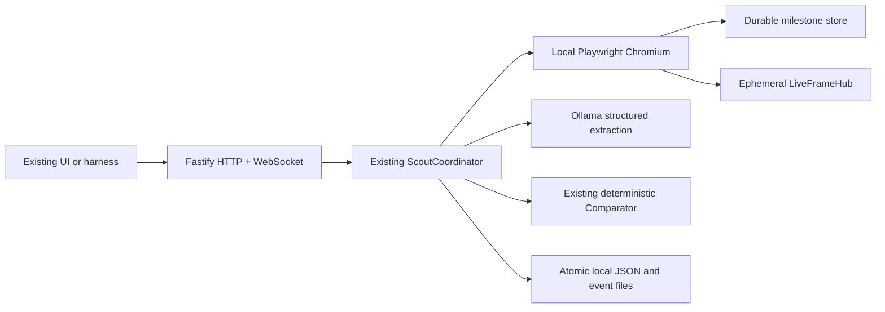

# Happy Scouts

Happy Scouts is the product-discovery and comparison backend for **Happy**, a chat-first AI shopping concierge built for the StraitsX AI Commerce Agents hackathon track.

It accepts product requirements that have already been confirmed by the user, assigns two complementary Scouts to each item, collects and validates shopping candidates, compares the shared candidate pool deterministically, streams truthful progress to the UI, and produces one confirmed shopping URL per item for the Closer service.

> **Important boundary:** this repository researches and compares products. It never signs in to merchant accounts, adds products to a cart, issues cards, enters payment information, performs checkout, or settles XSGD payments. Those responsibilities belong to Closer.

## Current status

The workflow now has two runnable AWS-free profiles. `mock` uses deterministic Scouts for fast development and CI. `local` launches real Playwright Chromium sessions, searches public pages, captures real screenshots, persists state to disk, and uses either Ollama for real structured extraction or an explicitly labelled fixture extractor for browser-only testing.

The AWS implementation remains available as a separate AgentCore application. It requires AWS credentials, AgentCore Browser access, DynamoDB, S3, and an enabled Bedrock model.

The AWS-free implementation uses the same coordinator, state machine, Comparator, events, confirmation flow, and Closer contract as AWS mode. Switching environments changes adapters, not product behaviour.

## Contents

- [What Happy Scouts owns](#what-happy-scouts-owns)
- [How the workflow works](#how-the-workflow-works)
- [Scout strategies and pipeline](#scout-strategies-and-pipeline)
- [Candidate comparison](#candidate-comparison)
- [Observability](#observability)
- [Runtime modes](#runtime-modes)
- [Quick start](#quick-start)
- [Manual API walkthrough](#manual-api-walkthrough)
- [Testing](#testing)
- [Real AWS agent](#real-aws-agent)
- [AWS-free fallback](#aws-free-fallback)
- [Repository structure](#repository-structure)
- [Security](#security)
- [Known limitations](#known-limitations)

## What Happy Scouts owns

Happy is divided into four conceptual stages:

```text
Concierge -> Curator -> Scouts -> Closer
```

- **Concierge** understands the shopping goal.
- **Curator** confirms the exact item specifications, budget, quantity, and delivery requirements.
- **Scouts**, implemented in this repository, discover and compare listings.
- **Closer**, owned by another teammate, receives confirmed shopping URLs and handles the purchasing workflow.

The handoff boundary is intentionally small:

```ts
type CloserHandoff = {
  activityId: string;
  selections: Array<{
    itemId: string;
    url: string;
  }>;
};
```

Closer does not receive browser sessions, scoring internals, prompts, rejected alternatives, credentials, or payment data.

## Core concepts

| Term | Meaning |
|---|---|
| Activity | One complete multi-item shopping research request. |
| Item | One locked product requirement within an Activity. |
| Scout | One research worker. Every item receives exactly two Scouts. |
| Candidate | A normalized merchant listing collected by a Scout. |
| Comparator | Deterministic TypeScript code that filters and ranks the shared candidate pool. |
| Selection | The highest-ranked eligible candidate for an item. |
| Event | A versioned, sequenced record of real workflow progress. |
| Milestone snapshot | A durable, replayable image captured after meaningful browser activity or an idle heartbeat. |
| Live frame | An ephemeral JPEG sent only while a local Scout has a visible viewer. It is never written to Activity replay. |
| Live View | A temporary interactive view into an active AWS-managed browser session. |

## How the workflow works



The end-to-end sequence is:

1. Curator submits all locked items in one request.
2. The API validates the request with Zod.
3. The coordinator creates two queued Scouts for each item.
4. Up to five item pairs run concurrently, which means at most ten active Scouts.
5. Overflow item pairs remain visible as `queued` and do not consume browser sessions.
6. Each Scout searches with a different strategy and normally gathers two candidates.
7. Candidates are normalized, URL-checked, deduplicated, validated, and persisted.
8. The two Scouts enter `comparing` together.
9. The Comparator applies hard filters, calculates scores, and stores the complete ranking.
10. The user reviews one selected listing per item.
11. Confirming every non-failed item changes the Activity to `ready_for_closer`.
12. Closer retrieves one item-associated URL per confirmed item.

Every state mutation is persisted before its corresponding event is published. This lets a reconnecting UI rebuild the same state from event replay.

## Scout strategies and pipeline

Every item receives two complementary Scouts:

| Scout | Strategy | Intended coverage |
|---|---|---|
| Scout A | `broad_mainstream` | Broad queries, large retailers, mainstream marketplaces, and familiar merchants. |
| Scout B | `specialist_independent` | Specialist retailers, independent sellers, category-specific merchants, and alternate query wording. |

Real-browser profiles rotate Google, Bing, and DuckDuckGo across recovery attempts. The local profile also falls back to product links from Shopee, Lazada, and Amazon Singapore search pages when general engines are challenged or expose no merchant results. It opens only safe public links with Playwright and asks the configured extractor to turn untrusted page text into a validated candidate object.

### Scout state machine

```text
Queued -> Pending -> Discovering -> Analyzing -> Gathering
                              ^                    |
                              |--------------------|
                         another candidate

Gathering -> Comparing -> Selected
```

- `queued`: waiting for one of five item slots.
- `pending`: assigned a slot but not yet navigating.
- `discovering`: searching or opening a potential listing.
- `analyzing`: checking specifications, seller evidence, reviews, stock, delivery, and red flags.
- `gathering`: validating and saving an eligible normalized candidate.
- `comparing`: both Scouts have completed and the shared pool is being ranked.
- `selected`: the item-level winning candidate has been stored.
- `failed`: recovery was exhausted for that Scout or item.
- `cancelled`: the Activity was cancelled before completion.

`Gathering -> Discovering` is a real transition, not a visual animation. It means the Scout saved one candidate and returned to the web to find another.

### Candidate coverage

The domain supports one to three candidates per Scout. The current mock and AWS drivers normally target two candidates each, giving up to four candidates before deduplication.

- A normal comparison should contain at least three unique candidates from both strategies.
- Comparison may continue with two candidates only after recovery is exhausted.
- A selection from fewer than three candidates or only one source strategy is marked `lowCoverage`.
- An item fails if fewer than two usable candidates remain.

### Recovery

Each Scout run is wrapped by `ResilientScoutDriver`:

- One initial attempt.
- Up to two backup attempts.
- Six-minute timeout per attempt wrapper.
- Cancellation propagated with `AbortSignal`.
- Browser sessions stopped in `finally` blocks.

If one Scout fails but the other provides at least two usable candidates, the item can still be selected with `lowCoverage: true`.

## Candidate comparison

The language model does not choose the winner. It may extract evidence, summarize reviews, and classify listing risks, but the final filtering and arithmetic are ordinary deterministic TypeScript.

### Hard filters

A candidate becomes ineligible when any of the following apply:

- Confirmed specification mismatch.
- Price above the user-defined cap.
- Incorrect quantity.
- Out of stock.
- Cannot ship to the requested country.
- Merchant rejected by the payment-eligibility field.
- Critical listing red flag.
- Authenticity score below 50/100.

### Scores

Price score:

```text
100 * lowest known total / candidate known total
```

Authenticity score:

```text
seller reputation       50%
listing consistency     30%
external corroboration  20%
- explicit red-flag penalties
```

Review score uses a Bayesian-adjusted rating with a 50-review prior, the peer-average rating, and a bounded sentiment adjustment. Missing review data receives a conservative score of 40.

Confidence combines:

- Evidence completeness: 60%.
- Candidate coverage: 25%.
- Source diversity: 15%.

### Ranking presets

| Preset | Price | Authenticity | Reviews |
|---|---:|---:|---:|
| `best_overall` | 40% | 35% | 25% |
| `lowest_price` | 60% | 25% | 15% |
| `trusted_seller` | 20% | 55% | 25% |
| `best_reviewed` | 20% | 25% | 55% |

Ties are broken deterministically by confidence, total price, and finally canonical URL.

### Deduplication

Tracking parameters are removed from listing URLs. Amazon ASINs and Shopee shop/item IDs are reduced to stable product URLs, and Lazada product queries are removed. Candidates are deduplicated using canonical URL, merchant, seller, and product variant. A candidate rejected as a duplicate does not count toward that Scout's quota, so it continues to the next result. The same product sold by different sellers remains a separate candidate.

## Confirmation and rejection

When every searchable item is selected, the Activity becomes `awaiting_confirmation`.

Confirming an item freezes that selection. When all non-failed items are confirmed, the Activity becomes `ready_for_closer` and the minimal Closer handoff becomes available.

When a user rejects a selected candidate:

1. The candidate ID and rejection reason are retained.
2. The next unused candidate within the first three ranked choices is selected immediately.
3. After the first three choices are exhausted, only that item's Scouts restart.
4. Existing useful candidates remain stored.
5. Rejected candidate IDs are excluded from the next comparison.
6. Confirmed items and unrelated Scouts remain untouched.

## Observability

Progress events and browser imagery are deliberately separate. A screenshot, live-frame, or Live View failure must not terminate a Scout.

### Events

Every event contains:

```ts
type ActivityEvent<T> = {
  schemaVersion: 1;
  eventId: string;
  sequence: number;
  type: string;
  activityId: string;
  itemId?: string;
  scoutId?: string;
  attempt: number;
  timestamp: string;
  payload: T;
};
```

Sequence numbers are scoped to an Activity. WebSocket clients reconnect with their last observed sequence and receive missed events before new live events.

### Durable milestone snapshots

- Captured after meaningful browser actions.
- Capped at one frame per second per Scout.
- Real browser driver attempts an idle heartbeat every five seconds.
- Mock snapshots remain in memory. Local-agent snapshots are stored under the gitignored `.happy-data/` directory and retained for one day.
- AWS snapshots are encrypted in S3 and expire after one day.
- Persistent state stores object keys, never expired presigned URLs.

Milestone snapshots answer “what was the last meaningful browser state?” and provide a stable fallback after an API restart. They are deliberately not captured several times per second because each one produces a stored object, an Activity mutation, and a replayable `scout.snapshot_ready` event.

### Ephemeral local live frames

In local mode, visible Scout tiles subscribe to a separate per-Scout WebSocket. Playwright captures one JPEG and the in-memory broker broadcasts it to every viewer of that Scout. These bytes are never written to `.happy-data`, emitted as Activity events, or sent to Closer.

Default demand policy:

| Viewer state | Requested rate | Result |
|---|---:|---|
| No visible viewer | 0 FPS | No continuous live capture; durable milestones continue. |
| Visible collapsed tile | 0.5 FPS | Low-cost overview across up to ten Scouts. |
| Expanded local viewer | 3 FPS | Smoother focused feed. |
| Hidden tab or off-screen tile | 0 FPS | Last successful image remains visible. |
| Completed Scout | 0 FPS | Stream closes and the final image remains visible. |

The server enforces a per-Scout cap of 3 FPS and a default global budget of 12 FPS. When demand exceeds that budget it allocates rates fairly. A slow connection drops stale frames instead of building a queue; after repeated backpressure it closes and the UI reconnects with exponential backoff. The viewer overlaps two image layers with a 200 ms cross-fade, making a low-frame-rate feed easier to follow without presenting it as video.

The frame endpoint is:

```text
GET WS /v1/scouts/{scoutId}/frames?view=collapsed|expanded
Sec-WebSocket-Protocol: happy.scout-jpeg.v1
```

The first text message reports `ready` and the server-negotiated FPS. Subsequent binary messages are raw JPEG bytes. `rate_changed`, `completed`, and `error` are text messages. Truthful stage movement still comes from `/v1/events`; frame messages never replace workflow events.

### Live View

The AWS UI should use lightweight S3 milestone snapshots for Scout tiles and request full Live View only when a user expands one Scout. The local UI uses the binary JPEG stream for both collapsed and expanded views.

In AWS mode, the backend creates a five-minute presigned AgentCore Live View WebSocket URL. It is temporary and must never be committed or logged. The application does not proxy the video stream.

Mock mode has no real browser session, so `POST /v1/scouts/{scoutId}/live-view-url` returns `503 live_view_unavailable`. Local mode returns a temporary URL for the built-in cross-fading JPEG viewer. It is read-only observability, not interactive remote browser control.

## Runtime modes

| Capability | Mock | Local agent (AWS-free) | AWS implementation |
|---|---|---|---|
| Browser | Synthetic snapshots | Local Playwright Chromium | AgentCore Browser + Playwright/CDP |
| Extraction | Deterministic fixtures | Ollama; fixture opt-in for browser testing | Amazon Bedrock |
| State | Memory | Atomic local JSON + event files | DynamoDB |
| Durable screenshots | Memory | Gitignored local filesystem | Encrypted S3 |
| Tile imagery | Synthetic snapshot | Demand-aware binary JPEG WebSocket | S3 milestone snapshot |
| Events | Fastify WebSocket | Fastify WebSocket | API Gateway WebSocket publisher |
| Expanded view | Unavailable | Built-in 3 FPS cross-fading viewer; optional headed Chromium | Direct AgentCore Live View |
| Credentials | None | None | AWS credentials and model access |
| Command | `pnpm dev:mock` | `pnpm dev:local-agent` | `apps/agentcore` deployment path |

### Important mode clarification

`pnpm dev` and `pnpm dev:mock` use the safe mock profile. `pnpm dev:local-agent` selects the real local-browser profile. `SCOUT_MODE=aws` is deliberately rejected by the local API because the AWS runtime is still a separate application in `apps/agentcore`.

The real AWS code runs through the separate `@happy/agentcore` application in `apps/agentcore`.

## Quick start

### Requirements

- Node.js 22 or newer.
- pnpm 10.14.0.

### Install and run

```bash
cp .env.example .env
pnpm install
pnpm dev
```

Open:

- Developer harness: [http://localhost:5173](http://localhost:5173)
- API health: [http://localhost:3001/health](http://localhost:3001/health)

Click **Start six-item demo** in the harness.

You should see:

- Six item rows and twelve Scout tiles.
- At most ten active Scouts.
- The sixth item pair initially queued.
- Genuine stage changes.
- Lightweight browser-like snapshots.
- Comparison events and selected items.
- Final Activity status `awaiting_confirmation`.

This proves the application workflow. It does not prove that Google, Shopee, or another real merchant can be browsed and extracted successfully.

### Test a real browser without AWS or a model

Install the Playwright-managed Chromium version pinned by this workspace:

```bash
pnpm browser:install
```

Run the standalone Google-to-Shopee visual smoke test:

```bash
pnpm smoke:local-browser
```

Open [http://127.0.0.1:3002](http://127.0.0.1:3002) while the command is running. The page shows the current stage, URL, and latest real Chromium screenshot. It opens Google, searches Google for the configured product on Shopee, and then opens Shopee search directly. This test requires no Bedrock model ID, Ollama model, Browserbase token, or AWS account.

Useful smoke settings:

```bash
LOCAL_BROWSER_HEADLESS=false pnpm smoke:local-browser
SMOKE_PRODUCT_QUERY="wireless earbuds" pnpm smoke:local-browser
LOCAL_SMOKE_HOLD_MS=120000 pnpm smoke:local-browser
```

Dynamic merchant pages receive a five-second render window and are recaptured about every 400 ms by default. The viewer fetches only when a new frame sequence exists and cross-fades between two image layers. Increase the initial window when testing a slow site with `LOCAL_SMOKE_TARGET_SETTLE_MS=10000`, or lower capture load with `LOCAL_SMOKE_FRAME_INTERVAL_MS=1000`.

The smoke destination can also be changed without editing code:

```bash
SMOKE_PRODUCT_QUERY="National University of Singapore" \
SMOKE_TARGET_SITE=nus.edu.sg \
SMOKE_TARGET_LABEL=NUS \
SMOKE_TARGET_URL=https://www.nus.edu.sg/ \
pnpm smoke:local-browser
```

To test a direct transition between two public pages without the intermediate Google search, provide both endpoints and enable direct-route mode:

```bash
LOCAL_SMOKE_DIRECT_ROUTE=true \
SMOKE_START_LABEL="McDonald's Singapore" \
SMOKE_START_URL=https://www.mcdonalds.com.sg/ \
SMOKE_TARGET_LABEL=NUS \
SMOKE_TARGET_URL=https://www.nus.edu.sg/ \
pnpm smoke:local-browser
```

The public-URL guard still applies to both endpoints. A CAPTCHA or automated-traffic page is displayed and labelled; the smoke test never attempts to bypass it.

For three or more pages, use pipe-separated route labels and URLs. Each page is held for `LOCAL_SMOKE_ROUTE_STEP_MS` before navigation continues:

```bash
SMOKE_ROUTE_LABELS='NUS|NTU|SMU' \
SMOKE_ROUTE_URLS='https://www.comp.nus.edu.sg/|https://www.ntu.edu.sg/|https://www.smu.edu.sg/' \
LOCAL_SMOKE_ROUTE_STEP_MS=5000 \
pnpm smoke:local-browser
```

### Run the complete local agent with fixture extraction

This combines real browsing and real screenshots with deterministic candidate fields. It is intended for wiring and observability tests, not product-quality evaluation:

```bash
LOCAL_EXTRACTION_MODE=fixture pnpm dev:local-agent
```

Open [http://localhost:5173](http://localhost:5173), start an Activity, expand a Scout to open its local viewer, reject a selection if desired, then confirm selected items to inspect the exact Closer handoff. The API health response identifies the active profile:

```bash
curl http://localhost:3001/health
```

Expected identifying fields are `mode: "local"`, `browser: "playwright"`, `extraction: "fixture"`, and `persistence: "local_disk"`.

### Run the complete local agent with Ollama

Install and start Ollama separately, install a model of your choice, and set its exact installed name:

```bash
OLLAMA_MODEL="your-installed-model" pnpm dev:local-agent
```

The API checks `/api/tags` during startup and fails clearly if Ollama is unreachable or that model is absent. It never silently substitutes fixture data. Each page is framed as untrusted content, Ollama receives a JSON schema, and the result must pass Zod validation. One repair request is attempted for malformed output. The deterministic Comparator—not Ollama—selects the winner.

Local results and screenshots survive API restarts in `.happy-data/`. Delete that directory manually only when you intentionally want a fresh local state. It is ignored by Git.

## Manual API walkthrough

The complete OpenAPI description is in [`openapi.yaml`](./openapi.yaml).

### Start one item

```bash
curl -X POST http://localhost:3001/v1/scout-runs \
  -H 'content-type: application/json' \
  -H 'idempotency-key: demo-key-1' \
  -d '{
    "activityId": "demo-activity-1",
    "items": [{
      "itemId": "gpu-1",
      "name": "Graphics card",
      "specs": {
        "memory": "16 GB",
        "use": "1440p gaming"
      },
      "quantity": 1,
      "priceCapSGD": 800,
      "rankingPreset": "best_overall",
      "shipToCountry": "SG",
      "locale": "en-SG"
    }]
  }'
```

The API responds with `202 Accepted`. The same idempotency key returns the existing Activity rather than creating another one.

### Read current state

```bash
curl http://localhost:3001/v1/scout-runs/demo-activity-1
```

### Pause, resume, or cancel

```bash
curl -X POST http://localhost:3001/v1/scout-runs/demo-activity-1/pause
curl -X POST http://localhost:3001/v1/scout-runs/demo-activity-1/resume
curl -X POST http://localhost:3001/v1/scout-runs/demo-activity-1/cancel
```

### Reject a selection

```bash
curl -X POST http://localhost:3001/v1/scout-runs/demo-activity-1/items/gpu-1/reject \
  -H 'content-type: application/json' \
  -d '{"reason":"I prefer a more established seller"}'
```

### Confirm a selection

```bash
curl -X POST http://localhost:3001/v1/scout-runs/demo-activity-1/confirm \
  -H 'content-type: application/json' \
  -d '{"itemIds":["gpu-1"]}'
```

### Retrieve the Closer handoff

```bash
curl http://localhost:3001/v1/scout-runs/demo-activity-1/closer-handoff
```

Expected shape:

```json
{
  "activityId": "demo-activity-1",
  "selections": [
    {
      "itemId": "gpu-1",
      "url": "https://example.com/shop/example-listing"
    }
  ]
}
```

### WebSocket replay

Connect to:

```text
ws://localhost:3001/v1/events?activityId=demo-activity-1&afterSequence=0
```

After reconnecting, replace `0` with the last sequence the client processed. The harness tracks this automatically and coalesces state refreshes instead of fetching once per event.

## HTTP API summary

| Method | Path | Purpose |
|---|---|---|
| `POST` | `/v1/scout-runs` | Start or idempotently return an Activity. |
| `GET` | `/v1/scout-runs/{activityId}` | Read complete current state. |
| `POST` | `/v1/scout-runs/{activityId}/pause` | Pause future Scout actions. |
| `POST` | `/v1/scout-runs/{activityId}/resume` | Resume a paused Activity. |
| `POST` | `/v1/scout-runs/{activityId}/cancel` | Cancel incomplete work. |
| `POST` | `/v1/scout-runs/{activityId}/items/{itemId}/reject` | Reject the current item selection. |
| `POST` | `/v1/scout-runs/{activityId}/confirm` | Confirm selected item IDs. |
| `GET` | `/v1/scout-runs/{activityId}/closer-handoff` | Retrieve confirmed URLs. |
| `GET` | `/v1/scouts/{scoutId}/snapshot` | Return or redirect to the latest snapshot. |
| `GET WS` | `/v1/scouts/{scoutId}/frames?view=collapsed\|expanded` | Stream ephemeral local JPEG frames using `happy.scout-jpeg.v1`. |
| `GET` | `/v1/scouts/{scoutId}/state` | Return the Scout, item name, and current structured state. |
| `POST` | `/v1/scouts/{scoutId}/live-view-url` | Generate a short-lived real-browser view when supported. |
| `GET` | `/v1/scouts/{scoutId}/live` | Render the local cross-fading frame viewer returned by local Live View. |
| `GET WS` | `/v1/events` | Replay and stream Activity events. |

## Testing

### Full validation

```bash
pnpm validate
```

This runs:

1. Repository secret scan.
2. TypeScript checks for all workspace packages.
3. Vitest test suite.
4. Production builds.

### Individual commands

```bash
pnpm typecheck
pnpm test
pnpm test:watch
pnpm build
pnpm secrets:check
```

### Covered behaviour

The tests currently cover:

- Request defaults and validation.
- Duplicate item rejection.
- Valid and invalid Scout transitions.
- `Gathering -> Discovering` candidate loop.
- URL canonicalization and private-network blocking.
- Untrusted-page-content framing.
- Authenticity calculation and thresholds.
- Every ranking preset and deterministic ranking.
- Six items creating twelve Scouts with no more than ten active.
- Candidate pooling and event replay.
- Idempotent Activity creation.
- Retained alternatives and item-scoped re-search.
- One-Scout failure with low-coverage selection.
- Non-fatal screenshot storage failure.
- Confirmation and Closer handoff.
- Atomic local-disk persistence, optimistic versions, idempotency, and event replay.
- Filesystem snapshot retention and traversal protection.
- Portable browser-driver stage flow and duplicate acceptance semantics.
- Ollama schema repair and local-profile configuration checks.

## Real AWS agent

### What is implemented

- AgentCore Runtime-compatible HTTP server with `/ping` and `/invocations`.
- One AgentCore Browser session per active Scout.
- Playwright connection over a presigned CDP WebSocket URL.
- Bedrock `Converse` extraction validated through `CandidateSchema`.
- DynamoDB Activity and event storage with optimistic versions.
- S3 screenshot storage and five-minute presigned reads.
- API Gateway WebSocket connection tracking and publishing.
- Five-minute AgentCore Live View URLs.
- CDK resources for DynamoDB, S3, the WebSocket API, its connection Lambda, and runtime IAM.

### What is not provisioned automatically

- The AgentCore Runtime resource itself.
- A production HTTP control-API Lambda/API Gateway integration.
- Cognito or another production JWT authorizer.
- Bedrock model access.
- Merchant-specific smoke-test fixtures.
- Production UI deployment.

### Required configuration

Never commit the real values. Store them in `.env`, the deployment environment, CDK parameters, or AWS Secrets Manager.

| Variable | Purpose |
|---|---|
| `AWS_REGION` | Runtime AWS region; defaults to `ap-southeast-1`. |
| `HAPPY_AWS_REGION` | CDK synthesis/deployment region. |
| `BEDROCK_MODEL_ID` | Enabled model used for structured listing extraction. |
| `AGENTCORE_BROWSER_ID` | AgentCore Browser identifier; default placeholder is `aws.browser.v1`. |
| `SCOUTS_TABLE_NAME` | DynamoDB state table. |
| `SCOUTS_SCREENSHOT_BUCKET` | S3 bucket for Scout snapshots. |
| `WEBSOCKET_MANAGEMENT_ENDPOINT` | Optional API Gateway management endpoint for event publishing. |
| `AGENTCORE_RUNTIME_ARN` | Runtime identifier used by the invocation adapter/control plane. |

### Validate infrastructure

```bash
HAPPY_AWS_REGION=ap-southeast-1 pnpm --filter @happy/infra synth
```

Synthesis does not create AWS resources and does not require committing credentials.

### Current Bedrock dependency

The real `BedrockBrowserScoutDriver` requires `BEDROCK_MODEL_ID` during startup. A dummy value will not work: the first `Converse` extraction call will fail.

Without Bedrock you can still test the complete mock workflow. You cannot currently run the real AgentCore Browser driver through its normal application path without also configuring Bedrock.

## AWS-free fallback

If the hackathon AWS account or invitation does not arrive, the workflow does not need to be discarded. The domain, coordinator, comparator, contracts, and UI protocol are already AWS-independent.

### Implemented fallback architecture



The implemented zero-cloud demo stack is:

- **Browser:** local Playwright Chromium.
- **Extraction:** local Ollama with JSON-schema structured outputs.
- **Coordinator and API:** the existing TypeScript runtime and Fastify API.
- **State:** atomic local JSON files with optimistic versions and 24-hour event replay.
- **Snapshots:** local filesystem with opaque hashed paths, one-day expiry, and per-Scout retention.
- **Events:** the existing Fastify WebSocket stream.
- **Visualization:** demand-aware binary JPEG streams with cross-fading tiles and a built-in expanded viewer.

Playwright can launch a local Chromium browser, navigate pages, and return screenshot buffers without a managed browser provider. Ollama exposes a local chat API and supports JSON-schema structured outputs, which fits the repository's existing Zod validation boundary.

### Why the existing design supports this

AWS services are behind interfaces in `@happy/runtime`:

- `ScoutDriver`
- `ActivityStore`
- `SnapshotStore`
- `EventPublisher`
- `LiveViewProvider`
- `LiveFramePublisher`
- `ActivityInvoker`

Those adapters now implement the existing ports. The coordinator, state machine, deterministic comparison, event contracts, rejection logic, and Closer handoff remain shared.

### Local adapters

| Adapter | Replaces | Responsibility |
|---|---|---|
| `BrowserScoutDriver` + `LocalPlaywrightBrowserSessions` | `BedrockBrowserScoutDriver` browser portion | Launch isolated contexts, search, navigate, extract page text, and capture screenshots. |
| `OllamaCandidateExtractor` | Bedrock `Converse` | Convert untrusted page content to candidate JSON and validate it with Zod. |
| `FileSnapshotStore` | S3 | Store short-lived images outside Git. |
| `LocalDiskActivityStore` | DynamoDB | Atomically persist Activity state and replayable events across restarts. |
| `InMemoryLiveFrameHub` | Tile screenshot polling | Fairly allocate capture demand and broadcast latest-only JPEG frames. |
| `LocalLiveViewProvider` | AgentCore Live View | Return the built-in cross-fading frame and state viewer. |

### Optional Browserbase path

If a hosted browser and shareable Live View are more important than having zero external accounts, Browserbase can replace AgentCore Browser while keeping Playwright and the current Scout flow. Browserbase provides Playwright-compatible sessions and temporary Live View links.

This is optional because it still requires a Browserbase account and API key. It is not the preferred emergency fallback when the goal is to eliminate all cloud-account dependencies.

### Capacity trade-off

The local adapter shares one Chromium process while giving each Scout an isolated browser context. Laptop capacity is configurable:

```env
MAX_CONCURRENT_ITEMS=2
```

That would run four Scouts at a time while leaving the remaining Scout tiles visibly queued. The workflow and UI semantics remain unchanged.

Live imagery can be tuned independently from workflow concurrency:

```env
LIVE_FRAME_COLLAPSED_FPS=0.5
LIVE_FRAME_EXPANDED_FPS=3
LIVE_FRAME_MAX_SCOUT_FPS=3
LIVE_FRAME_GLOBAL_FPS_BUDGET=12
LIVE_FRAME_JPEG_QUALITY=60
LIVE_FRAME_MAX_BUFFERED_BYTES=1048576
```

These are server limits, not promises of exact frame timing. Page rendering and screenshot capture speed may produce a lower effective rate. Raising them increases CPU, JPEG encoding, memory, and network use; it does not make product discovery more accurate.

### Google and Shopee smoke test

The local Playwright adapter supports this test:

```text
Chromium -> Google search -> Shopee listing -> screenshot -> structured extraction
```

Google or Shopee may show bot challenges, consent pages, or CAPTCHAs. The Scout must display the condition through observability and fail or try a backup strategy; it must never attempt to bypass a CAPTCHA.

`pnpm smoke:local-browser` performs this exact navigation and exposes the screenshot viewer at port 3002. Search engines and merchants may still present challenges or change markup; the full Scout uses alternate engines and reports exhaustion instead of bypassing access controls.

## Repository structure

```text
.
├── apps/
│   ├── agentcore/       # Real AgentCore Runtime-compatible process
│   ├── api/             # Local Fastify HTTP and WebSocket API
│   └── harness/         # Minimal React diagnostic UI
├── packages/
│   ├── aws/             # DynamoDB, S3, AgentCore Browser, Bedrock, WebSocket adapters
│   ├── contracts/       # Zod schemas and public TypeScript types
│   ├── core/            # State machine, URL security, dedupe, deterministic scoring
│   ├── runtime/         # Coordinator, portable browser driver, ports, mock adapters
│   └── local/           # Playwright, Ollama, disk state, snapshots, local viewer
├── infra/               # TypeScript CDK stack
├── tests/               # Unit and coordinator integration tests
├── agentcore/           # AgentCore configuration
├── openapi.yaml         # HTTP contract for UI and Closer integration
├── CONTEXT.md           # Product and team decisions
├── SYSTEM_DESIGN.md     # Architecture and state design
├── WALKTHROUGH.md       # Non-technical product explanation
└── SCOUTS_IMPLEMENTATION_PLAN.md
```

The central dependency rule is:

```text
contracts <- core <- runtime <- API/application
                           ^
                           |
                     AWS/local adapters
```

Domain code in `@happy/core` must never import AWS SDK packages.

## Security

### Untrusted webpage content

All merchant and search-engine content is treated as data, never as agent instruction.

- Page-originated requests to change goals or invoke tools are ignored.
- Model output is parsed and validated with Zod before storage.
- Navigation permits only public HTTP and HTTPS URLs.
- Localhost, private IP addresses, file URLs, and executable schemes are blocked.
- Page text never receives environment variables, AWS credentials, system prompts, or internal instructions.

### Restricted Scout actions

Scouts may:

- Search.
- Navigate.
- Read.
- Extract evidence.
- Capture screenshots.

Scouts may not:

- Authenticate.
- Add to cart.
- Download files.
- Request cards.
- Enter addresses, credentials, or payment information.
- Submit purchases.

### Public repository rules

- `.env` and `.env.*` are ignored.
- Only `.env.example` may be committed from the `.env` family.
- AWS credentials, StraitsX secrets, wallet keys, production URLs with tokens, and presigned URLs must never be committed.
- Generated screenshots, recordings, logs, local databases, and CDK output are ignored.
- Run `pnpm secrets:check` before staging or committing.
- Secret findings must be investigated; repository history is never rewritten automatically.

## Known limitations

- Search-result extraction is generic rather than merchant-specific; some engines and merchants can return consent pages, irrelevant utility links, bot challenges, or CAPTCHAs.
- The fixture extraction profile proves browser and workflow integration but does not prove candidate facts are accurate. Use Ollama for real evidence extraction.
- The local expanded view is a refreshed screenshot stream, not interactive Browserbase- or AgentCore-style remote desktop control.
- Google-to-Shopee navigation has been validated locally; merchant-specific end-to-end extraction still depends on the selected Ollama model and live site markup.
- Search-result link extraction is intentionally simple and may be affected by consent pages, layout changes, bot protection, or CAPTCHAs.
- Merchant payment eligibility is currently supplied as a candidate field; the Closer-owned eligibility adapter is not integrated.
- CDK does not yet deploy the production HTTP control API, AgentCore Runtime, or authentication.
- Activity-wide 20-minute termination and abandoned-session cleanup are not yet separate scheduled infrastructure jobs.
- The production UI is owned by another teammate; this repository includes only a developer harness.

## Troubleshooting

### `pnpm dev` works, but no real websites appear

That is expected because `pnpm dev` intentionally defaults to mock. Use `LOCAL_EXTRACTION_MODE=fixture pnpm dev:local-agent` for a real browser without a model, or configure Ollama and run `pnpm dev:local-agent` for real extraction.

### Live View returns `503`

That is expected only in mock mode because no real browser session exists. Local mode returns its built-in snapshot-view URL.

### Local mode exits before the API starts

If the error names Playwright, run `pnpm browser:install`. If it names Ollama, check that Ollama is running and that `OLLAMA_MODEL` exactly matches an entry returned by its local `/api/tags` endpoint. Use `LOCAL_EXTRACTION_MODE=fixture` only when you intentionally want browser-only integration data.

### `BEDROCK_MODEL_ID` contains the placeholder

Local mock mode still works. The AgentCore application will reject the placeholder during startup.

### A sixth item looks stuck in `queued`

This is expected while five item pairs are active. It begins after one active pair reaches `selected` or `failed`.

### An item is marked `lowCoverage`

Recovery completed with fewer than three unique candidates or only one successful source strategy.

### Browser extraction fails on a merchant

The Scout retries using backup search strategies. Persistent merchant-specific failures should be recorded and excluded from the final demo merchant set.

## Documentation

- [Product context](./CONTEXT.md)
- [Approved implementation plan](./SCOUTS_IMPLEMENTATION_PLAN.md)
- [AWS-free implementation plan](./AWS_FREE_IMPLEMENTATION_PLAN.md)
- [System design](./SYSTEM_DESIGN.md)
- [Non-technical walkthrough](./WALKTHROUGH.md)
- [OpenAPI contract](./openapi.yaml)
- [Contributor and agent instructions](./AGENTS.md)

## Useful external references

- [Playwright browser installation](https://playwright.dev/docs/browsers)
- [Playwright screenshots](https://playwright.dev/docs/screenshots)
- [Ollama structured outputs](https://docs.ollama.com/capabilities/structured-outputs)
- [Ollama OpenAI-compatible API](https://docs.ollama.com/api/openai-compatibility)
- [Browserbase Playwright sessions](https://docs.browserbase.com/platform/browser/getting-started/using-browser-session)
- [Browserbase Live View](https://docs.browserbase.com/platform/browser/observability/session-live-view)

## License

No license has been added yet. Treat the repository as source-available for the hackathon until the team chooses and commits a license.
