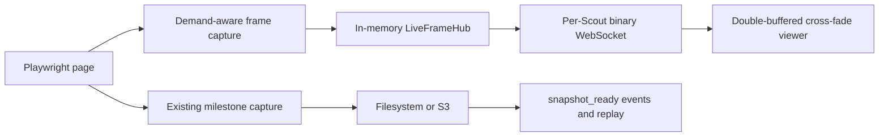

# Smooth Scout Imagery Implementation Plan

## Status

**Implemented on 2026-08-15.**

Implementation verification:

- `pnpm validate` passes secret scanning, strict TypeScript checks, 22 tests, and all workspace builds.
- Contract and API tests cover the `happy.scout-jpeg.v1` text/binary separation.
- Hub tests cover broadcast, subscriber cleanup, per-Scout demand, global fair allocation, completion, and rate-capped publication.
- Browser-driver tests verify that durable milestone screenshots and ephemeral live frames use separate callbacks.
- A real local Chromium smoke run reached Google and `example.com` and ran the 400 ms capture loop. Google presented its automated-traffic challenge during search, which remained visible and was not bypassed.

Detailed browser performance telemetry and ten-real-browser laptop profiling remain optional tuning work; the configured fair global budget is covered deterministically by tests.

This plan improves the perceived continuity of Scout browser imagery and exposes the live imagery through a backend-consumable API. It does not alter discovery, extraction, comparison, confirmation, rejection, or the Closer handoff.

## Outcome

Provide two intentionally separate forms of browser imagery:

1. **Durable milestone snapshots** for Activity state, event replay, reconnects, and auditability.
2. **Ephemeral live frames** for a smoother low-frame-rate visual feed while a Scout is being watched.

The expanded local Scout view should normally display three frames per second with a short cross-fade. Collapsed Scout tiles should use approximately one frame every two seconds. Ten collapsed Scouts therefore request about five frames per second in total, while expanded views receive a temporarily higher allocation.

The implementation remains a screenshot stream, not interactive remote-browser control and not a video proxy.

## Why the existing snapshot path should not simply run faster

The current path is:

```text
Playwright screenshot
  -> Scout callback
  -> coordinator one-frame-per-second throttle
  -> filesystem or S3 write
  -> Activity state mutation
  -> scout.snapshot_ready event
  -> UI fetches the new image
```

Increasing this path to three frames per second would produce unnecessary image files, optimistic state writes, event records, and replay noise. It would also couple visual smoothness to persistence latency.

The smoother path should therefore be ephemeral and independent:



Live-frame failures remain observability failures and must never terminate Scout research.

## Recommended frame policy

| Viewer state | Requested rate | Persistence | Intended use |
|---|---:|---|---|
| No viewer | No continuous stream; existing five-second heartbeat only | Latest milestone retained | Background work |
| Collapsed tile | 0.5 FPS | No live frames persisted | Ten-Scout overview |
| Expanded tile | 3 FPS | No live frames persisted | Smooth focused observation |
| Browser hidden | 0 FPS | Existing milestone path continues | Avoid wasted work |
| Scout completed | Stop live capture; show final milestone | Final snapshot retained | Stable completed state |

Configuration limits:

```env
LIVE_FRAME_COLLAPSED_FPS=0.5
LIVE_FRAME_EXPANDED_FPS=3
LIVE_FRAME_MAX_SCOUT_FPS=3
LIVE_FRAME_GLOBAL_FPS_BUDGET=12
LIVE_FRAME_JPEG_QUALITY=60
LIVE_FRAME_MAX_BUFFERED_BYTES=1048576
```

All values are server-capped. A client cannot request an unlimited rate.

## Architecture changes

### 1. Keep milestone snapshots unchanged

Preserve the current `SnapshotStore`, `scout.snapshot_ready` event, one-frame-per-second coordinator cap, local five-frame retention, S3 lifecycle, and non-fatal failure behavior.

Milestones should still be captured after meaningful actions and through the existing idle heartbeat. They reconstruct the latest visible state after a reconnect or process restart.

### 2. Add a live-frame runtime port

Add provider-independent interfaces under `@happy/runtime`:

```ts
type LiveFrame = {
  activityId: string;
  itemId: string;
  scoutId: string;
  capturedAt: string;
  contentType: "image/jpeg";
  bytes: Uint8Array;
};

interface LiveFramePublisher {
  requestedFps(scoutId: string): number;
  publish(frame: LiveFrame): Promise<void>;
}
```

The browser driver receives callbacks for live frames separately from durable screenshots. Domain code and the Comparator must not import Playwright, WebSocket, filesystem, or AWS packages.

### 3. Implement an in-memory `LiveFrameHub`

The local API owns a bounded in-memory broker keyed by Scout ID.

Responsibilities:

- Track connected viewers and whether each is collapsed or expanded.
- Return the highest required rate for that Scout, subject to per-Scout and global budgets.
- Broadcast one captured JPEG to every viewer of that Scout.
- Capture only once even if several viewers watch the same Scout.
- Retain at most the latest frame in memory for a newly connected viewer.
- Drop an older pending frame when a newer one arrives.
- Never write ephemeral frames to `.happy-data`, DynamoDB, S3, or event replay.
- Remove frame bytes and demand immediately after the last viewer disconnects.

### 4. Make Playwright capture demand-aware

Add a live-frame loop to `BrowserScoutDriver`:

1. Read the requested FPS for the Scout.
2. If it is zero, wait without capturing.
3. If it is non-zero, capture one JPEG and publish it to the hub.
4. Wait for the server-calculated interval.
5. Never run two screenshots concurrently for the same Scout.
6. Stop immediately when the Scout ends or its signal is aborted.

Meaningful-action captures should reuse the same screenshot bytes for both the ephemeral frame and durable milestone whenever possible. This avoids taking two nearly identical screenshots.

The existing screenshot heartbeat remains the fallback when no live-frame hub is available.

### 5. Add a backend-consumable frame WebSocket

Add:

```text
GET WS /v1/scouts/{scoutId}/frames?view=collapsed|expanded
```

Protocol name: `happy.scout-jpeg.v1`.

Messages:

- Text status message on connection: `ready`, negotiated FPS, Scout ID, and protocol version.
- Binary messages after that: raw JPEG bytes for that Scout only.
- Text status messages for `paused`, `completed`, `rate_limited`, and `reconnecting` where applicable.

The client already knows the Scout ID from the URL, so JPEG messages do not need base64 encoding or a custom binary header. WebSocket ordering preserves frame order.

The existing Activity WebSocket remains responsible for truthful stages, candidates, comparison, and durable `snapshot_ready` events. Browser frames must not be mixed into Activity replay.

For production authentication, an upstream authorizer or a short-lived scoped stream token must prove that the caller can view the Activity containing that Scout. Local development can retain the existing stub identity.

### 6. Add backpressure and fair allocation

Before sending a frame to a connection:

- Check its buffered byte count.
- Skip the frame if the configured threshold is exceeded.
- Never queue multiple stale JPEGs for a slow client.
- Disconnect a persistently stalled client after a bounded grace period.

When total demand exceeds the global FPS budget:

1. Preserve a minimum collapsed rate for visible Scouts.
2. Give the remaining budget to expanded Scouts.
3. Divide equivalent demand fairly rather than letting the first connection consume the budget.
4. Notify affected viewers of the negotiated rate.

Multiple viewers of one Scout share one capture allocation.

### 7. Smooth the UI with double buffering

Create a reusable `ScoutFrameStream` component for the harness and publish its protocol to the UI teammate.

The component uses two overlapping image layers:

```text
new JPEG blob
  -> createObjectURL
  -> load hidden image layer
  -> fade it to opacity 1 over 150–250 ms
  -> retire the old layer
  -> revoke the old object URL
```

Rules:

- Keep the last successful image visible during reconnects.
- Display `Live`, `Reconnecting`, or `Last frame` rather than a blank rectangle.
- Disconnect or downgrade the stream when the tile is outside the viewport or the browser tab is hidden.
- Use `view=expanded` only while the Scout is actually expanded.
- Reconnect with exponential backoff capped at five seconds.
- Fall back to `GET /v1/scouts/{scoutId}/snapshot` when the frame channel is unavailable.
- Stop animating when the Scout reaches `selected`, `failed`, or `cancelled`.

CSS cross-fading makes a 2–3 FPS feed feel substantially more continuous without pretending it is 30 FPS video.

### 8. Update the standalone smoke viewer

Reuse the same double-buffer/cross-fade behavior in `packages/local/src/smoke.ts`.

The smoke viewer should continue recapturing dynamic pages, expose its current URL and stage, and clearly display merchant traffic blocks instead of reporting a protected URL as a successful product page.

The smoke tool remains CLI-only. It should not become a public arbitrary-navigation endpoint.

### 9. Advertise provider capabilities

Extend runtime information returned by `/health`:

```ts
type ImageryCapability =
  | "snapshots"
  | "binary_websocket"
  | "agentcore_live_view";
```

Expected behavior:

| Runtime | Collapsed tiles | Expanded view |
|---|---|---|
| Mock | Durable synthetic snapshots | Snapshot fallback |
| Local | Binary WebSocket live frames | Binary WebSocket at expanded rate |
| AWS | S3 milestone snapshots | Direct AgentCore Live View URL |

Do not proxy AgentCore Live View through this WebSocket. The new frame stream is primarily the AWS-free local-browser implementation.

## Public API additions

### WebSocket frame subscription

```text
ws://localhost:3001/v1/scouts/{scoutId}/frames?view=expanded
Sec-WebSocket-Protocol: happy.scout-jpeg.v1
```

Initial status message:

```json
{
  "type": "ready",
  "schemaVersion": 1,
  "scoutId": "scout-example-a",
  "view": "expanded",
  "framesPerSecond": 3
}
```

Subsequent binary messages contain JPEG bytes. This API can be consumed by the developer harness, the teammate-owned UI, or another backend that is authorized to relay the feed.

### Existing APIs retained

- `GET /v1/scouts/{scoutId}/snapshot` remains the durable fallback.
- `POST /v1/scouts/{scoutId}/live-view-url` continues returning the appropriate provider-specific expanded view.
- `GET WS /v1/events` remains the replayable structured event channel.
- Closer continues receiving only `{ activityId, selections: [{ itemId, url }] }`.

## Security and privacy

- Authorize access by Activity and Scout before opening a frame stream.
- Never accept a browser navigation target through the frame WebSocket.
- Keep the existing public-URL and DNS/private-network guards.
- Do not log JPEG bytes, frame URLs, page text, credentials, or query tokens.
- Bound all memory per Scout and per connection.
- Do not persist ephemeral live frames.
- Do not expose filesystem paths or S3 object keys to clients.
- Retain the rule that Scouts cannot log in, add to cart, download, request cards, or purchase.
- Use TLS (`wss://`) outside localhost.

## Delivery sequence

1. Add live-frame types and the `LiveFramePublisher` port.
2. Implement `InMemoryLiveFrameHub` with demand tracking, latest-frame retention, backpressure, and fair FPS allocation.
3. Separate ephemeral frame publication from the existing durable snapshot callback.
4. Add the demand-aware Playwright capture loop and reuse action screenshot bytes.
5. Add the per-Scout binary WebSocket route and protocol negotiation.
6. Implement the double-buffered React viewer with visibility-based rate changes and snapshot fallback.
7. Apply the same cross-fade behavior to the standalone smoke viewer.
8. Update OpenAPI companion documentation, TypeScript UI contracts, README, system design, and the UI integration guide.
9. Add unit, contract, integration, browser, and load tests.
10. Profile ten collapsed Scouts plus one expanded Scout and tune default budgets before demo use.

## Tests

### Unit and contract tests

- Subscriber demand calculates the correct collapsed and expanded rate.
- Multiple viewers of one Scout cause only one capture.
- Per-Scout and global FPS caps cannot be exceeded.
- A slow WebSocket client receives the newest frame rather than an accumulated backlog.
- Disconnecting the final viewer reduces continuous capture demand to zero.
- Live-frame publication never calls `SnapshotStore` or appends an Activity event.
- Milestone snapshots and event replay remain unchanged.
- Screenshot and frame-stream failure never fails a Scout.
- Completed Scouts stop live capture and retain their final milestone image.
- Unauthorized Scout subscriptions are rejected.

### UI tests

- Frame order is preserved.
- Old object URLs are revoked.
- Cross-fade completes without flashing a blank background.
- The last frame remains visible during reconnect.
- Hidden tabs and off-screen tiles release or downgrade demand.
- Snapshot fallback activates when the binary stream is unavailable.

### Browser and load tests

- Lazada and McDonald’s dynamic pages visibly update without blank frames.
- Shopee traffic protection is displayed honestly as a blocked page.
- One expanded Scout sustains approximately 3 FPS with p95 capture-to-display latency below one second locally.
- Ten collapsed Scouts remain within the configured global budget.
- Expanding one Scout does not stall research or structured Activity events.
- Live frames do not cause `.happy-data` growth beyond durable snapshot retention.

## Acceptance criteria

- The expanded local Scout viewer appears continuous at 2–3 FPS with no blank flashes.
- Collapsed tiles remain understandable at approximately 0.5 FPS.
- A backend or UI can consume documented per-Scout JPEG WebSockets.
- Durable snapshot writes remain capped and replay semantics do not change.
- Slow viewers cannot increase memory without bound.
- Ten-Scout operation respects the global capture budget.
- Closing or hiding a viewer promptly reduces capture work.
- Imagery failure remains non-fatal.
- AWS AgentCore Live View remains direct and unproxied.
- No Scout gains login, cart, download, card, or payment capabilities.

## Deliberate non-goals

- 30 or 60 FPS video.
- Audio.
- Interactive mouse or keyboard takeover.
- Persisting or replaying every live frame.
- Exposing the standalone arbitrary-target smoke navigator as a public API.
- Proxying AgentCore Live View video through the application backend.

## Recommended hackathon cut

If time is limited, implement in this order:

1. Per-Scout binary JPEG WebSocket.
2. Expanded view at server-capped 3 FPS.
3. Double-buffered cross-fade and snapshot fallback.
4. Backpressure that drops stale frames.
5. Collapsed 0.5 FPS feeds and global fair allocation.
6. Visibility-aware demand and detailed performance telemetry.

This cut delivers the visible improvement and backend API without coupling live smoothness to durable storage.
