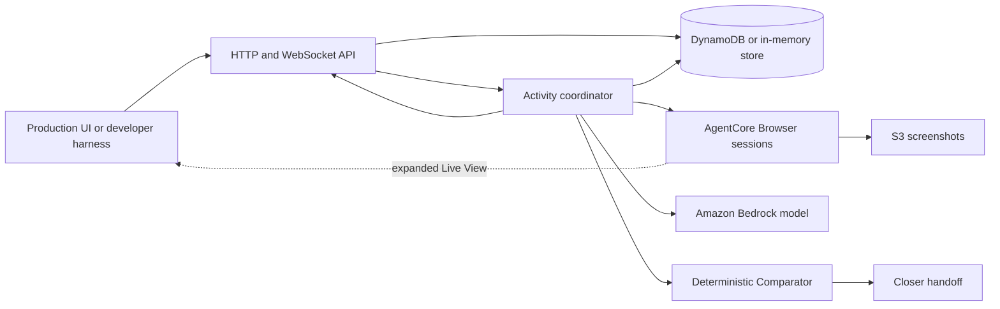
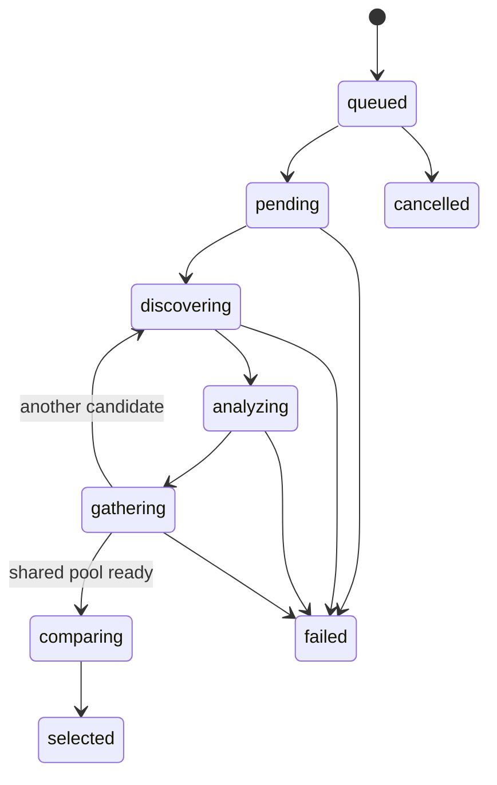

# Happy Scouts System Design

## Architecture

One Activity coordinator owns the item queue. Five workers process item pairs, creating no more than ten browser sessions. All mutable state is persisted before its corresponding event is published.

## State

The item-level state is `queued`, `searching`, `comparing`, `selected`, `confirmed`, or `failed`. Activity control state is `running`, `paused`, or `cancelled`; outcome state is `searching`, `awaiting_confirmation`, `ready_for_closer`, `failed`, or `cancelled`.

## Data and event flow

1. Curator submits an Activity with locked item specifications and an idempotency key.
2. The API validates the request and creates two queued Scouts per item.
3. The coordinator runs up to five item pairs concurrently.
4. Scouts publish stage changes, candidate results, and screenshot references.
5. Candidates are canonicalized, safety-checked, deduplicated, and persisted.
6. Comparator filters, scores, ranks, and records the selection.
7. The UI confirms selections; the API emits `activity.ready_for_closer`.
8. Closer reads `{ activityId, selections: [{ itemId, url }] }`.

Events carry a schema version, Activity-scoped sequence, attempt number, timestamp, and relevant Activity, item, and Scout identifiers. Reconnecting clients replay events after their last sequence and then receive live events.

## Scoring

Candidates must first satisfy the locked specification, budget, variant, stock, shipping, merchant eligibility, critical-red-flag checks, and authenticity floor of 50/100.

- Price: `100 * lowestKnownTotal / candidateKnownTotal`.
- Authenticity: seller reputation 50%, listing consistency 30%, external corroboration 20%, minus red-flag penalties.
- Reviews: Bayesian-adjusted rating with a 50-review prior and bounded sentiment adjustment.
- Confidence: evidence completeness, source diversity, coverage, and cross-Scout agreement.

The default preset weights Price 40%, Authenticity 35%, and Reviews 25%. Other presets change weights but never bypass hard filters.

## Observability

Progress and visual streams are independent. A Scout captures after meaningful actions at no more than one frame per second and emits an idle frame every five seconds. S3 objects are encrypted, expire after one day, and are accessed through short-lived URLs. Expanded views use a direct presigned AgentCore Live View connection instead of proxying video through the API.

## Security boundary

- Page content is untrusted data and never becomes system or tool instruction.
- Navigation is limited to public HTTP/HTTPS targets; localhost, private IPs, file URLs, and executable schemes are rejected.
- Scouts cannot authenticate, add to cart, download, request cards, or perform payment operations.
- Logs, fixtures, prompts, screenshots, and events are sanitized.
- Runtime secrets come from environment variables or AWS Secrets Manager and never enter repository files.

## Failure handling

- Retry a failed operation once, then use up to two backup source strategies.
- Compare two candidates only after recovery is exhausted and flag `lowCoverage`.
- Fail an item with fewer than two valid candidates.
- A screenshot or Live View failure is logged but does not fail research.
- Browser sessions close in `finally` blocks and abandoned sessions are eligible for cleanup.
- Rejection advances through retained rankings before restarting only that item.

## Integration contracts

The HTTP and WebSocket schemas are exported from the contracts package and exposed through the API. Closer receives only item IDs and URLs. Rich evidence, ranked backups, scoring, and rejection history remain private to Scouts.
