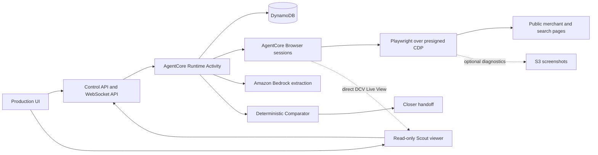
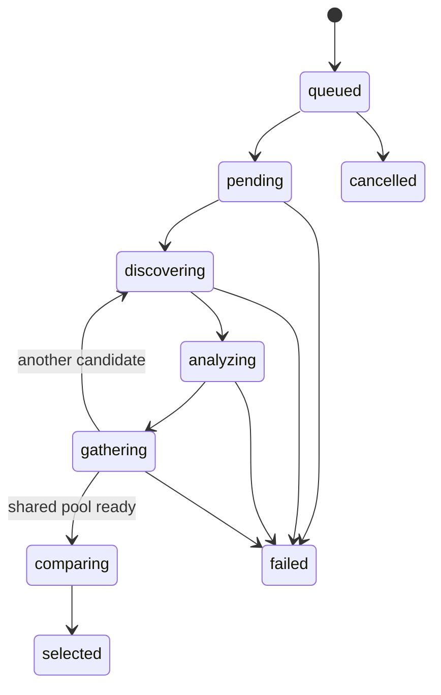

# Happy Scouts System Design

## Architecture

One Activity coordinator owns the item queue. Five workers process item pairs, creating no more than ten browser sessions. All mutable state is persisted before its corresponding event is published.

The real Activity runs asynchronously in AgentCore Runtime. AWS implementations remain behind runtime interfaces, while domain and Comparator code do not import AWS SDK packages. A deterministic in-memory mock exists only for unit, contract, coordinator, and UI-harness testing; it is not a real-browser runtime.

Deployment begins from a trusted checkout of the public repository. The AgentCore CLI uses a generated, gitignored target configuration and remotely builds the root Dockerfile for Linux ARM64. AgentCore Runtime receives the resulting ECR image rather than GitHub credentials or a live repository mount.

## State

The item-level state is `queued`, `searching`, `comparing`, `selected`, `confirmed`, or `failed`. Activity control state is `running`, `paused`, or `cancelled`; outcome state is `searching`, `awaiting_confirmation`, `ready_for_closer`, `failed`, or `cancelled`.

## Data and event flow

1. Curator submits an Activity with locked item specifications and an idempotency key.
2. The API validates the request and creates two queued Scouts per item.
3. The coordinator runs up to five item pairs concurrently.
4. Scouts persist stage changes and candidate results, then publish website callbacks.
5. Candidates are canonicalized, safety-checked, deduplicated, and persisted.
6. Comparator filters, scores, ranks, and records the selection.
7. The UI confirms selections; the API emits `activity.ready_for_closer`.
8. Closer reads `{ activityId, selections: [{ itemId, url }] }`.

Events carry a schema version, Activity-scoped sequence, attempt number, timestamp, and relevant Activity, item, and Scout identifiers. Reconnecting clients replay events after their last sequence and then receive live events.

## Scoring

Candidates must first satisfy the locked specification, budget, variant, stock, shipping, merchant eligibility, critical-red-flag checks, and authenticity floor of 50/100.

- Price: `100 * lowestKnownTotal / candidateKnownTotal`.
- Authenticity: seller reputation 50%, listing consistency 30%, external corroboration 20%, minus red-flag penalties.
- Reviews: Bayesian-adjusted rating with a 50-review prior and bounded sentiment adjustment.
- Confidence: evidence completeness, source diversity, coverage, and cross-Scout agreement.

The default preset weights Price 40%, Authenticity 35%, and Reviews 25%. Other presets change weights but never bypass hard filters.

## Observability

Progress and visual streams are independent. Direct AgentCore DCV Live View is the primary UI observability path for every active Scout; screenshots are optional internal evidence or diagnostics and never drive the website tiles. The website receives a stable viewer URL containing an opaque fragment capability. The read-only viewer exchanges that capability for a fresh, short-lived signed connection and then connects the user's browser directly to AgentCore, so signed URLs and video never traverse website state or callbacks. Viewer responses allow framing only from configured Happy frontend origins.

The item-pair sequencer publishes durable `item.progress` values `0 Discovering`, `1 Analyzing`, `2 Gathering`, `3 Comparing`, and `4 Selected`. It suppresses unchanged values and preserves the previous durable stage, including the intentional `2 -> 0` coverage loop. Each Scout publishes its own real stage through `agent.update`; no synthetic lag is added.

## Security boundary

- Page content is untrusted data and never becomes system or tool instruction.
- Navigation is limited to public HTTP/HTTPS targets; localhost, private IPs, file URLs, and executable schemes are rejected.
- Scouts cannot authenticate, add to cart, download, request cards, or perform payment operations.
- Logs, fixtures, prompts, screenshots, and events are sanitized.
- Runtime secrets come from environment variables or AWS Secrets Manager and never enter repository files.

## Failure handling

- Retry a failed operation once, then use up to two backup source strategies.
- Compare two candidates only after recovery is exhausted and flag `lowCoverage`.
- Fail an item with fewer than two valid candidates.
- A screenshot or Live View failure is logged but does not fail research or stage callbacks.
- Browser sessions close in `finally` blocks and abandoned sessions are eligible for cleanup.
- Rejection advances through retained rankings before restarting only that item.

## Integration contracts

The HTTP and WebSocket schemas are exported from the contracts package and exposed through the API. Closer receives only item IDs and URLs. Rich evidence, ranked backups, scoring, and rejection history remain private to Scouts.
